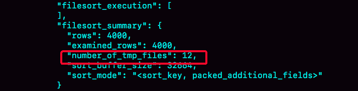

# 16 | “order by”是怎么工作的？

## 前置

MySQL 会给每个线程分配一块内存用于排序，称为 sort_buffer。


排序时可能在内存中完成，也可能需要使用外部排序，这取决于排序所需的内存和参数 sort_buffer_size 。

sort_buffer_size，就是 MySQL 为排序开辟的内存（sort_buffer）的大小。如果要排序的数据量小于 sort_buffer_size，排序就在内存中完成。但如果排序数据量太大，内存放不下，则不得不利用磁盘临时文件辅助排序。


如何确定一个排序语句是否使用了临时文件：

```sql

/* 打开optimizer_trace，只对本线程有效 */
SET optimizer_trace='enabled=on'; 

/* @a保存Innodb_rows_read的初始值 */
select VARIABLE_VALUE into @a from  performance_schema.session_status where variable_name = 'Innodb_rows_read';

/* 执行语句 */
select city, name,age from t where city='杭州' order by name limit 1000; 

/* 查看 OPTIMIZER_TRACE 输出 */
SELECT * FROM `information_schema`.`OPTIMIZER_TRACE`\G

/* @b保存Innodb_rows_read的当前值 */
select VARIABLE_VALUE into @b from performance_schema.session_status where variable_name = 'Innodb_rows_read';

/* 计算Innodb_rows_read差值 */
select @b-@a;
```

通过查看 OPTIMIZER_TRACE 的结果来确认的，可以从 number_of_tmp_files 中看到是否使用了临时文件。number_of_tmp_files 表示的是，排序过程中使用的临时文件数。




## 两种排序

全字段排序：查询语句所需要的列的值，随着排序全部入 sort buffer,buffer不够使用额外的临时文件； 

rowId 排序：只有主键 id 和需要被排序列的值入 sort buffer,这样可以减少对 buffer size 的使用，或者减少临时文件的数量因为每行的大小变小了(但此种方式需要在 id 排序好后再回到主表根据id再将所需要的列值查询出来)。


max_length_for_sort_data，是 MySQL 中专门控制用于排序的行数据的长度的一个参数。它的意思是，如果单行的长度超过这个值，MySQL 就认为单行太大，要换一个算法。


可以控制这个参数，来让 MySQL 选择使用 rowid 排序。


## 全字段排序 VS rowid 排序

- 如果 MySQL 实在是担心排序内存太小，会影响排序效率，才会采用 rowid 排序算法，这样排序过程中一次可以排序更多行，但是需要再回到原表去取数据

- 如果 MySQL 认为内存足够大，会优先选择全字段排序，把需要的字段都放到 sort_buffer 中，这样排序后就会直接从内存里面返回查询结果了，不用再回到原表去取数据。

这也就体现了 MySQL 的一个设计思想：如果内存够，就要多利用内存，尽量减少磁盘访问。对于 InnoDB 表来说，**rowid 排序会要求回表多造成磁盘读，因此不会被优先选择**。


其实，并不是所有的 order by 语句，都需要排序操作的。从上面分析的执行过程，我们可以看到，MySQL 之所以需要生成临时表，并且在临时表上做排序操作，其原因是原来的数据都是无序的。