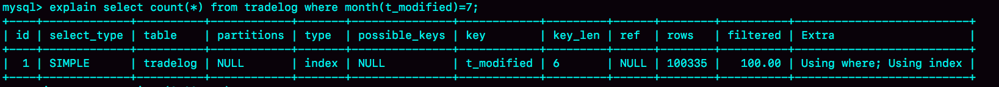

# 18 | 为什么这些SQL语句逻辑相同，性能却差异巨大？

```
CREATE TABLE `tradelog` (
  `id` int(11) NOT NULL,
  `tradeid` varchar(32) DEFAULT NULL,
  `operator` int(11) DEFAULT NULL,
  `t_modified` datetime DEFAULT NULL,
  PRIMARY KEY (`id`),
  KEY `tradeid` (`tradeid`),
  KEY `t_modified` (`t_modified`)
) ENGINE=InnoDB DEFAULT CHARSET=utf8mb4;
```


## 案例一：条件字段函数操作

对于如下语句

```sql
select count(*) from tradelog where month(t_modified)=7;
```

**对索引字段做函数操作，可能会破坏索引值的有序性，因此优化器就决定放弃走树搜索功能**。

需要注意的是，**优化器并不是要放弃使用这个索引**。在这个例子里，放弃了树搜索功能，优化器可以选择遍历主键索引，也可以选择遍历索引 t_modified，优化器对比索引大小后发现，索引 t_modified 更小，遍历这个索引比遍历主键索引来得更快。因此最终还是会选择索引 t_modified。




## 案例二：隐式类型转换

```sql
select * from tradelog where tradeid=110717;
```

交易编号 tradeid 这个字段上，本来就有索引，但是 explain 的结果却显示，这条语句需要走全表扫描。这是因为，tradeid 的字段类型是 varchar(32)，而输入的参数却是整型，所以需要做类型转换。


MySQL 中，字符串和数字做比较的话，是将字符串转换成数字。

上面的语句实际上相当于

```sql
 select * from tradelog where  CAST(tradid AS signed int) = 110717;
```

## 案例三：隐式字符编码转换

字符集不同只是条件之一，连接过程中要求在被驱动表的索引字段上加函数操作，是直接导致对被驱动表做全表扫描的原因。