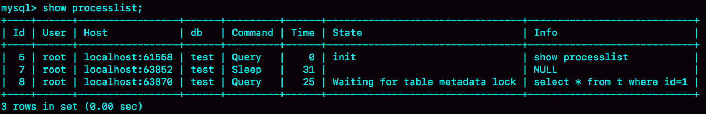
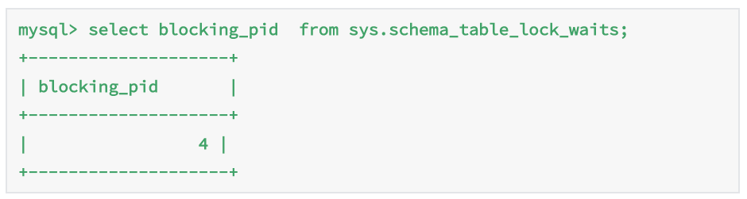
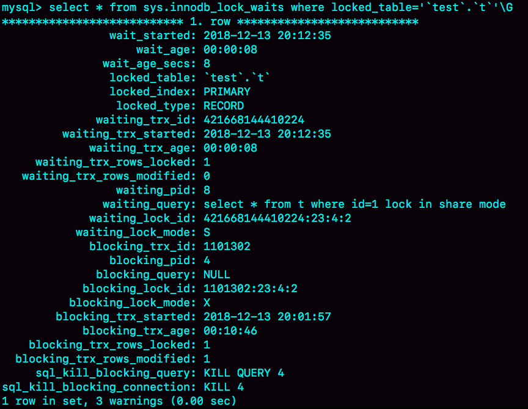

# 19 | 为什么我只查一行的语句，也执行这么慢？

## 第一类：查询长时间不返回

```mysql
mysql> select * from t where id=1;
```


一般碰到这种情况。大概率是表 t 被锁住了。


分析：


首先执行 `show processlist` 命令，查看当前语句的状态。


- 等 MDL 锁




如上图，出现了 `Waiting for table metadata lock`, 这表示现在有一个线程正在表 t 上请求或者持有 MDL 写锁，把 select 语句堵住了。


这类问题的处理方式，就是找到谁持有 MDL 写锁，然后把它 kill 掉。


通过查询 `sys.schema_table_lock_waits` 这张表，就可以直接找出造成阻塞的 process id，把这个连接用 kill 命令断开即可。



- 等 flush

  

MySQL 里面对表做 flush 操作的用法，一般有以下两个：


```sql
flush tables t with read lock;
flush tables with read lock;
```

正常这两个语句执行起来都很快，除非它们也被别的线程堵住了。

出现 `Waiting for table flush` 状态的可能情况是：有一个 flush tables 命令被别的语句堵住了，然后它又堵住了.select 语句。

这种处理方式和上一种一样。


- 等行锁

```sql
mysql> select * from t where id=1 lock in share mode; 
```


于访问 id=1 这个记录时要加读锁，如果这时候已经有一个事务在这行记录上持有一个写锁， select 语句就会被堵住。查询谁占用着写锁，可以用下面的语句，查询表 `sys.innodb_lock_waits`。

```sql
mysql> select * from t sys.innodb_lock_waits where locked_table='`test`.`t`'\G
```



​	

​      4 号线程是造成堵塞的罪魁祸首。 而干掉这个罪魁祸首的方式，就是 KILL QUERY 4 或 KILL 4。

​	

- KILL QUERY 4：表示停止 4 号线程当前正在执行的语句，而这个方法其实是没有用的。因为占有行锁的是 update 语句。
- KILL 4：表示直接断开这个连接。连接被断开时，会自动回滚这个连接里面正在执行的线程，同时也就释放了 id = 1 上的行锁。


## 第二类 查询慢

- 字段没有索引，走了全表扫描。
- 当前事务查询的数据被别的事务大量修改，导致一致性读要依次执行 undo log， 才能返回一致性是视图结果。

