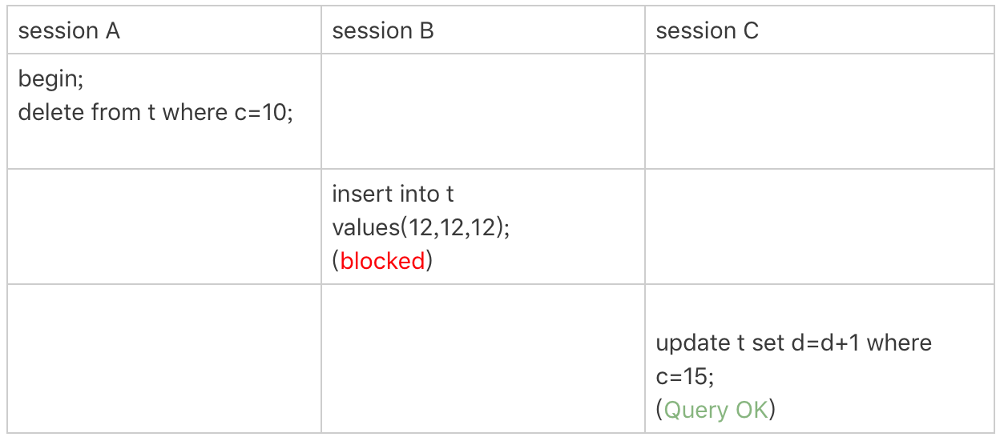

# 21 | 为什么我只改一行的语句，锁这么多？

## 加锁规则

**原则 1：加锁的基本单位是 next-key lock。next-key lock 是前开后闭区间。**

**原则 2：查找过程中访问到的对象才会加锁。**

**优化 1：索引上的等值查询，给唯一索引加锁的时候，next-key lock 退化为行锁。**

**优化 2：索引上的等值查询，向右遍历时且最后一个值不满足等值条件的时候，next-key lock 退化为间隙锁。**

**一个 bug：唯一索引上的范围查询会访问到不满足条件的第一个值为止。（`5.x 系列 <=5.7.24，8.0 系列 <=8.0.13。之后的版本已经修复`）**


## 锁查看

```sql
select * from performance_schema.data_locks;
```


LOCK_MODE: 锁模式（`IX`: 表意向排它锁， `X`： NextKey-Lock, `X, REC_NOT_GAP`: 行锁， `X,GAP`: 间隙锁，`LOCK_INSERT_INTENTION` 插入意向锁）


[Mysql performance_schema的data_locks 和 data_lock_waits说明 - 简书 (jianshu.com)](https://www.jianshu.com/p/cfaea55f5a28)

[MySQL 意向共享锁、意向排他锁、死锁_意向共享锁和意向排他锁_coder-shen的博客-CSDN博客](https://blog.csdn.net/qq_42500831/article/details/123751272)


## 案例环境

创建表

```sql
CREATE TABLE `t`
(
    `id` int(11) NOT NULL,
    `c`  int(11) DEFAULT NULL,
    `d`  int(11) DEFAULT NULL,
    PRIMARY KEY (`id`),
    KEY `c` (`c`)
) ENGINE = InnoDB;
insert into t values (0, 0, 0),(5, 5, 5), (10, 10, 10), (15, 15, 15), (20, 20, 20), (25, 25, 25);
```


所有案例都是在可重复读隔离级别 (repeatable-read) 下验证的。


## 案例一：等值查询间隙锁


加锁规则分析：

- 根据原则1，加锁的规则是 next-key lock, sessionA 的加锁范围是 （5，10]。
- 根据优化2，id = 7 是一个等值查询，而 id = 10 不满足等值条件，next-key lock 退化为间隙锁。最终加锁范围 （5，10）。

## 案例二：非唯一索引等值锁


加锁规则分析：


session A

- 根据原则1，加锁的单位是 next-key lock, 因此会给 （0，5] 加上 next-key。
- c 是普通索引，仅访问到 c = 5 是不能马上停下来的，需要向右继续遍历，查到 c = 10 才放弃，根据原则 2，访问到的对象都要加锁，因此要给（5，10] 加 next-key lock。
- 根据优化2，等值判断，向右遍历，最后一个值不符合等值条件，退化成间隙锁 （5，10）
- 根据原则2，只有**访问到的对象才会加锁**。这个查询使用了覆盖索引，并不需要访问主键索引。所以主键索引上没有加任何锁，这也就是为什么 session B 的 update 语句可以执行，而 Session C 会被 session A 的间隙锁锁住。（**`锁是加在索引上的`**）


> lock in share mode ： 覆盖索引查询时，只锁覆盖索引。
>
> for update：系统认为接下来要更新数据，故不管查询列是否用到覆盖索引，会给普通索引加 next-key 锁，主键索引满足条件的行加行锁。


这个例子说明:

- 锁是加在索引上的
- 如果要用 lock in share mode 来给行加锁避免数据被更新的话，必须得绕过覆盖索引的优化，在查询字段中加入索引不存在的字段。


## 案例三：主键索引范围锁


Session A 的锁和下面语句的锁是一样的吗 ？ 语句等价，但是加的锁不一样。

```sql
select * from t where id=10 for update;
```

加锁分析：

1、开始执行的时候，要找到一个 id = 10 的行，加上了 next-key lock (5,10]。根据优化1，主键 id 上的等值条件，退化成行锁，只加了 id = 10 这一行的行锁。

2、范围查询继续向后找，找到 id = 15 停下来，需要加上 next-key lock (10, 15],注意这是范围查询，不是等值查询，不会触发优化2。

> 本人的 8.0.19 版本只锁了 （10， 15）的间隙锁。猜测 MySQL 有优化，认为唯一索引，只需要加间隙锁。


## 案例四：非唯一索引范围锁


加锁分析：

session A 与上个案例不同的是，字段换成了普通索引 c, 所以第一次用 c = 10 定位记录的时候，加上 next-key lock （5， 10], 没有优化规则，不会蜕变为行锁，因此最终 session A 上加的锁是 （5，10],(10, 15] 这两个 next-key lock。


## 案例五：唯一索引范围锁 bug


这个 bug 已经修复了，下面的情况只适用于 5.x 系列 <=5.7.24，8.0 系列 <=8.0.13。


session A 是一个范围查询，按照原则1的话，应该只是在索引 id 上只加 （10，15] 这个 next-key lock,并且由于 id 是唯一键，所以循环判断到 id = 15 这一行就停止了。

但是在是线上， InnoDB 会往前扫描到第一个不满足条件的行为止，也就是 id = 20, 而且由于这是个范围扫描，因此索引 id 上的 （15，20] 这个 next-key lock 也会被锁上。


## 案例六：非唯一索引上存在"等值"的例子


给表插入一条新纪录

```sql
insert into t values(30,10,30);
```

此时索引 c 上的记录如下图


此时，看如下的 sql




> delete 语句加锁的逻辑，其实跟 select ... for update 是类似的


加锁分析：

1、session A 在遍历的时候，访问到第一个 c = 10 的记录，加上了 （c=5,id=5） 到 （c=10, id=10）这个 next-key lock。

2、session A 向右查找，知道碰到  c = 15 这一行，循环才结束。根据优化2，等值查询，向右遍历，最后一个值不符合查询条件，退化为 （c=10,id=10）到（c=15,id=15）的间隙锁。 

3、最终加的锁为，(写锁会回表把聚簇索引加锁) 

- 非唯一索引 c 上：加锁(5,10]和(10,15) => (5,15); 
- 主键索引 id 上：加行锁 id=10 和 id=30；


## 案例七：limit 语句加锁


对照案例六，session A 的 delete 语句加了 limit 2。表 t 中 c = 10 的记录其实只有两条，因此这两个语句删除效果是一样的，但是加锁的效果不同。可以看到 session B 的 insert 语句执行通过了，和案例六不同。


这是因为，delete 语句中明确了 limit 2 的限制，遍历到 （c = 10, id = 30） 这一行后，满足条件的语句已经有两条，循环就结束了。

因此，索引 c 上的加锁范围就变成了 （5，10]。


> 启示：**删除数据的时候尽量加 limit**,这样不仅可以控制删除数据的条数，让操作更安全，还能减小加锁的范围。


## 案例八：一个死锁的例子


这个案例目的是说明：**next-key lock 实际上是间隙锁和行锁加起来的结果**。


死锁分析：

1、session A 启动事务后执行查询语句加 lock in share mode，在索引 c 上加了 next-key lock(5,10] 和间隙锁 (10,15)；

2、session B 的 update 语句也要在索引 c 上加 next-key lock(5,10] ，进入锁等待；

3、然后 session A 要再插入 (8,8,8) 这一行，被 session B 的间隙锁锁住。由于出现了死锁，InnoDB 让 session B 回滚。


原因：session B 的“加 next-key lock(5,10] ”操作，实际上分成了两步，先是加 (5,10) 的间隙锁，加锁成功；然后加 c=10 的行锁，这时候才被锁住的。（**间隙锁是不互斥的**）


> 启示：分析加锁规则的时候可以用 next-key lock 来分析。但是要知道，具体执行的时候，是要分成**间隙锁和行锁**两段来执行的。


## 总结

可重复读隔离级别遵守两阶段锁协议，所有加锁的资源，都是在事务提交或者回滚的时候才释放的。


在最后的案例中，知道 next-key lock 实际上是由间隙锁加行锁实现的。


如果切换到读提交隔离级别 (read-committed) 的话，就只剩下行锁的部分。其实读提交隔离级别在外键场景下还是有间隙锁，在**读提交隔离级别**下还有一个优化，即：**语句执行过程中加上的行锁，在语句执行完成后，就要把“不满足条件的行”上的行锁直接释放了，不需要等到事务提交**。也就是说，读提交隔离级别下，锁的范围更小，锁的时间更短，这也是不少业务都默认使用读提交隔离级别的原因。


读提交的事务隔离级别的好处： 

1、不会有mvvc的快照 

2、在提交后即解锁，锁的时间更短 

3、不会有间隙锁，均为行锁，锁的范围更小


