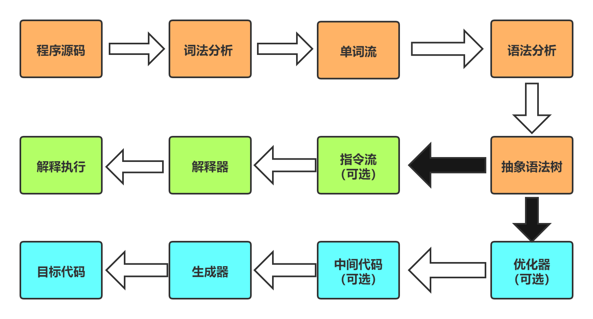

[TOC]

### Java 代码执行流程一览


### JVM 的结构模型

Java 编译器输入的指令流基本上是一种基于 **栈的指令集架构**，另外一种指令集架构则是基于 **寄存器的指令集架构**。

具体来说，两种架构之间的区别：

- 基于栈式架构的特点
  - 设计和实现更简单，适用于资源受限的系统。
  - 避开了寄存器的分配难题：使用零地址指令方式分配。
  - 指令流中的指令大部分是零地址指令，其执行过程依赖于操作栈（只操作栈顶元素）。指令集更小，编译器容易实现。
  - 不需要硬件支持，可移植性更好，更好实现跨平台。
- 基于寄存器架构的特点
  - 典型的应用是 x86 的二进制指令集。
  - 指令集架构则完全依赖硬件，可移植性差。
  - 性能优秀和执行更高效。
  - 花费更少的指令去完成一项操作。
  - 在大部分情况下，基于寄存器架构的指令集往往都以一地址指令、二地址指令和三地址指令为主，而基于栈式架构的指令集却是以零地址指令为主。

### JVM 的生命周期

#### 虚拟机的启动

Java 虚拟机的启动是通过引导类加载器（Bootstrap Class Loader）创建一个初始类（Initial Class）来完成的，这个类是由虚拟机的具体实现指定的。

#### 虚拟机的执行

执行一个所谓的 Java 程序的时候，真正执行的是一个叫做 Java 虚拟机的进程。

#### 虚拟机的退出

有如下几种情况：

- 程序正常执行结束
- 程序在执行中遇到了异常或错误而异常终止
- 操作系统出现错误而导致虚拟机进程终止
- 线程调用 Runtime 类的 `halt`方法 或 System 类的 `exit` 方法

### Java 虚拟机家族

1、虚拟机始祖: Sun Classic： 世界上第一款商用 Java 虚拟机

2、三大商用（高性能）虚拟机： 使用在通用硬件平台上

- HotSpot VM: 最广泛使用的，通过编译器与解释器协同工作，在最优的程序响应时间与最佳执行性能中取得平衡。
- JRockit: 世界上最快的 Java 虚拟机，全部代码都靠即时编译器编译后执行。
- J9: 广泛应用于 IBM 的各种 Java 产品。

3、Azul VM / BEA Liquid VM : 与特定硬件平台绑定、软硬件配合专有虚拟机，性能较三大高性能虚拟机更为强悍。

4、其他：Apache Harmony\Google Dalvik VM \...

### 内存结构概述


### 类加载子系统


- 类加载器子系统负责从文件系统或者网络中加载 class 文件，class 文件在文件开头有特定的文件标识。（0xCAFEBABE）(咖啡宝贝)
- ClassLoader 只负责 class 文件的加载，至于它是否可以运行，则由 Execution Engine决定。
- 加载的类信息存放在一块称为**方法区**的内存空间，除了类的信息外，方法区中还会存放**运行时常量池信息**，可能还包括字符串字面量和数字常量（这部分常量信息是 Class 文件中常量池部分的内存映射）。
#### 类的加载过程


##### 加载

1、通过一个类的全限定名获取定义此类的**二进制字节流**
2、将这个字节流所代表的静态存储结构转换为方法区的运行时数据结构
3、**在内存中生成一个代表这个类的 Java .lang.Class 对象**，作为方法区这个类的各种数据的访问入口。

##### 链接

###### 验证（Verify）

- 目的在于确保 Class 文件的字节流中信息符合当前虚拟机要求，保证被加载类的正确性，不会危害虚拟机自身安全。
- 主要包括四种验证：文件格式验证、元数据验证、字节码验证、符号引用验证
 ###### 准备（Prepare）
 - **为类变量（静态变量）分配内存并设置该类变量的初始值，即零值。**
 - 这里**不包含用 final 修饰的 static，因为 final 在编译的时候就会分配了，准备阶段会显式初始化**（final static 在这个阶段显式初始化）
 - 这里**不会为实例变量分配初始化**，类变量会分配在方法区中，而实例变量是会随对象一起分配到Java 堆中。

###### 解析（Resolve）

 - 将常量池内的**符号引用转换为直接引用**的过程。
 - 事实上，解析操作往往会伴随着JVM在执行完初始化之后再操作。
 - 解析动作主要针对类、接口、字段、类方法、接口方法、方法类型等。对应常量池中的 Constant_class_info、constant_fieldref_info、constant_methodref_info 等。

##### 初始化

 - **初始化阶段就是执行==类构造器方法`<clinit>()`==的过程**。（不是类中的构造器）
 - 此方法不需定义，是 Javac 编译器自动收集类中所有**类变量的赋值动作和静态代码块中的语句**合并而来。
 - 构造器方法中指令按语句在源文件中出现的**顺序**执行。静态语句块中只能访问到定义在静态语句块之前的变量，定义在它之后的变量，在前面的静态语句块可以赋值，但是不能访问。（能赋值的原因：在准备阶段，已经为类变量分配内存并设置了零值）
 - **`<clinit>（）`不同于类的构造器，**（关联：构造器是虚拟机视角下的`<init>()`），不需要显式地调用父类构造器。
 -  JVM会保证在子类的`<clinit>()`执行前，父类的`<clinit>()`已经执行完毕。因此在 Java 虚拟机中第一个被执行的`<clinit>()`方法的类型肯定是java.lang.Object。
 -  `<clinit>（）`方法对于类或接口来说并不是必需的，如果一个类中没有静态语句块，也没有对类变量的赋值操作，那么编译器可以不为这个类生成`<clinit>()`方法。
 -  接口中不能使用静态语句块，但仍然有变量初始化的赋值操作，因此接口与类一样都会生成`<clinit>()`方法。但接口与类不同的是，执行接口的`<clinit>()`方法不需要先执行父接口的`<clinit>()`方法，因为只有当父类接口中定义的变量被使用时，父类接口才会被初始化。此外，接口的实现类在初始时也一样不会执行接口的`<clinit>()` 方法。
 -  虚拟机必须保证一个类的`<clinit>()`方法在多线程下被同步加锁

```java
public class ClassInitTest {

  private static int num = 1;

  static {
    num = 2;
    number = 20;
    System.out.println(number);//非法的前向引用
  }

  private static int number = 10; //linking之prepare: number = 0 --> inital : 20 --> 10

  public static void main(String[] args) {
    System.out.println(ClassInitTest.num);// 1
    System.out.println(ClassInitTest.number); // 10
  }
}

```
 从字节码文件可以看到：在链接阶段，会为类变量分配内存并设置该类变量的初始值，即零值。所以在 static 代码块中给 number 赋值并不会报错，但是初始化阶段按照出现顺序初始化，所以最后 number = 10；但是在静态代码块中打印 number 会报错，报非法前向引用。 


#### 类加载器的分类

JVM 支持两种不同的类加载器：一种是**启动类加载器**（Bootstrap ClassLoader）也称为引导类加载器，这个类加载器实用 C/C++ 实现，是虚拟机自身的一部分，Java 的核心类库都是使用引导类加载器进行加载的；一种是**自定义类加载器**（User-Defined ClassLoader），这些类加载器都由 Java 语言实现，独立存在与虚拟机外部，这些类加载器全都继承自抽象类 java.lang.ClassLoader。


 ##### 启动类加载器（引导类加载器，Bootstrap ClassLoader）

* 这个类加载器使用 **C/C++** 语言实现，嵌套在 JVM 内部
* 它用来加载 Java 的**核心类库**（JAVA_HOME/jre/lib/rt.jar、resource.jar 或 sum.boot.path 路径下的内容），用于提供 JVM 自身需要的类
* 加载扩展类和应用程序类加载器，并指定为他们的父类加载器
* 出于安全考虑，Boostrap 启动类加载器只加载包名为 java,javax,sun 等开头的类

##### 扩展类加载器（Extension ClassLoader）

* Java 语言编写，由`sun.misc.Launcher$ExtClassLoader`实现
* 派生于 ClassLoader 类
* 父类加载器为启动类加载器
* 从 java.ext.dirs 系统属性所指定的目录中加载类库，或从 JDK 的安装目录的 jre/lib/ext 子目录（扩展目录）下加载类库。如果用户创建的 JAR 放在此目录下，也会自动由扩展类加载器加载

##### 应用类程序加载器（系统类加载器，AppCLassLoader）

*  Java 语言编写，由`sun.misc.Launcher$ExtClassLoader`实现
* 派生于`ClassLoader`类
* 父类加载器为扩展类加载器
* 它负责加载环境变量 classpath 或系统属性 java.class.path 指定路径下的类库
* 该类加载器是程序中默认的类加载器，一般来说，Java 应用的类都是由它来加载完成
* 通过`ClassLoader#getSystemClassLoader()`方法可以获取到该类加载器


> JDK1.8 环境下
```java
public class ClassLoaderTest {

  public static void main(String[] args) {
    System.out.println("********启动类加载器******");
    //获取BootstrapClassLoader能够加载的api的路径
    URL[] urLs = Launcher.getBootstrapClassPath().getURLs();
    for (URL url : urLs) {
      System.out.println(url.toExternalForm());
    }

    //获取Extension ClassLoader能够加载的api的路径
    System.out.println("************扩展类加载器*************");
    String extDirs = System.getProperty("java.ext.dirs");
    for(String path: extDirs.split(";")){
      System.out.println(path);
    }
  }
}

```

```
********启动类加载器******
file:/C:/Program%20Files/Java/jdk1.8.0_291/jre/lib/resources.jar
file:/C:/Program%20Files/Java/jdk1.8.0_291/jre/lib/rt.jar
file:/C:/Program%20Files/Java/jdk1.8.0_291/jre/lib/sunrsasign.jar
file:/C:/Program%20Files/Java/jdk1.8.0_291/jre/lib/jsse.jar
file:/C:/Program%20Files/Java/jdk1.8.0_291/jre/lib/jce.jar
file:/C:/Program%20Files/Java/jdk1.8.0_291/jre/lib/charsets.jar
file:/C:/Program%20Files/Java/jdk1.8.0_291/jre/lib/jfr.jar
file:/C:/Program%20Files/Java/jdk1.8.0_291/jre/classes
************扩展类加载器*************
C:\Program Files\Java\jdk1.8.0_291\jre\lib\ext
C:\Windows\Sun\Java\lib\ext
```

##### 用户自定义类加载器
###### 为什么要自定义类加载器
* 隔离加载类，避免类冲突
* 修改类加载的方式
* 扩展加载源
* 防止源码泄露

###### 用户自定义类加载器的实现步骤

1. 继承抽象类`java.lang.ClassLoader`类
2. 把自定义的类加载逻辑写在`findclass()`方法中
3. 如果需求不复杂，可以直接继承`URLClassLoader`类，可以避免自己去编写`findClass()`方法以及获取字节码流的方式，使得自定义类加载器编写更加简洁

> ClassLoader类，它是一个抽象类，其后所有的类加载器都继承自它（不包括启动类加载器）

| 方法名称                                             | 描述                                                         |
| ---------------------------------------------------- | ------------------------------------------------------------ |
| getParent()                                          | 返回该类加载器的超类加载器                                   |
| loadClass(String name)                               | 加载名称为 name 的类，返回结果为 java.lang.Class 类的实例    |
| findClass(String name)                               | 查找名称为 name 的类，返回结果为 java.lang.Class 类的实例    |
| findLoadedClass(String name)                         | 查找名称为 name 的已经被加载的类，返回结果为 java.lang.Class 类的实例 |
| defineClass(String name, byte[] b, int off, int len) | 把字节数组 b 中的内容转换为一个 Java 类，返回结果为 java.lang.Class 类的实例 |
| resolveClass(Class<?> c)                             | 连接指定的一个 Java 类                                       |

##### 获取ClassLoader的途径

1、**获取当前类的 ClassLoader：clazz.getClassLoader()**
2、**获取当前线程上下文的 ClassLoader： Thread.currentThread().getContextClassLoader()**
3、**获取系统的 ClassLoader：ClassLoader.getSystemClassLoader()**
4、**获取调用者的 ClassLoader：DriverManager.getCallerClassLoader()**

#### 双亲委派机制

Java 虚拟机对 class 文件采用的是 **按需加载** 的方式，也就是说当需要使用该类时才会将它的 class 文件加载到内存生成 class 对象。而且在加载某个类的 class 文件时，Java 虚拟机采用的是 **双亲委派机制**，即把加载请求交由父类处理，它是一种任务委派模式。


##### 工作原理

1). 如果一个类加载器收到了类加载请求它不会自己先去加载，而是把这个请求委托给父类的加载器去执行。
2). 如果父类加载器还存在其父类加载器，则进一步向上委托，依次递归，请求最终将到达顶层的启动类加载器。
3). 如果父类加载器可以完成类加载任务，就成功返回，倘若父类加载器无法完成加载任务，子加载器才会尝试自己去加载，这就是双亲委派模式。

##### 优势

==避免重复加载 和 避免核心类被篡改==

##### 双亲委派模型破坏举例（4次）

原生的 JDBC 中 Driver 驱动本身只是一个接口，并没有具体的实现，具体的实现是由不同数据库类型去实现的。(接口由引导类加载器加载，实现由应用类加载器加载)例如，MySQL 的 mysql-connector-java.jar 中的 Driver 类具体实现的。 原生的 JDBC 中的类是放在 rt.jar 包的，是由启动类加载器进行类加载的，在 JDBC 中的 Driver 类中需要动态去加载不同数据库类型的 Driver 类，而 mysql-connector-java.jar 中的 Driver 类是用户自己写的代码，那启动类加载器肯定是不能进行加载的，既然是自己编写的代码，那就需要由应用程序启动类去进行类加载。于是乎，这个时候就引入**线程上下文件类加载器(Thread Context ClassLoader)** 。有了这个东西之后，程序就可以把原本需要由启动类加载器进行加载的类，由应用程序类加载器去进行加载了。


##### 模块化下的类加载器（JDK9）
1) 扩展类加载器（Extension Class Loader）被平台类加载器（Platform Class Loader）取代。
2) 平台类加载器和应用类加载器都不再派生自`java.net.URLClassLoader`。启动类加载器、平台类加载器、应用程序类加载器全部继承于`jdk.internal.loader.BuiltinClasLoader`,在`BuiltinClasLoader`中实现了新的模块化架构下类如何从模块中加载的逻辑，以及模块中资源可访问性的处理。

JDK9 之前的类加载器继承架构


JDK9 以及之后的类加载器继承架构


从上图可发现 "BootClassLoader” 存在，启动类加载器现在是 Java 虚拟机内部和 Java 类库共同协作实现的类加载器，尽管有了 BootClassLoader 这样的 Java 类，但为了与之前的代码保持兼容，所有在获取启动类加载器的场景中仍然返回 null 来代替，而不会得到 BootClassLoader 的实例。

**类加载委派关系：当平台和应用类加载器收到类加载请求，在委派给父类加载器加载前，要先判断该类是否能够归属到某一个系统模块中，如果可以找到这样的归属关系，就要优先委派给负责那个模块的加载器完成加载，（也许可以算是对双亲委派的第四次破坏）。**


#### 其他

在 JVM 中表示两个 class 对象是否为同一个类存在两个**必要**条件：
* 类的全限定类名必须一致，包括包名。
* 加载这个类的 ClassLoader（指 ClassLoader 实例对象）必须相同

换句话说，在 JVM 中，即使这两个类对象（class 对象）来源同一个 Class 文件，被同一个虚拟机加载，但只要加载它们的 ClassLoader 实例对象不同，那么这两个类对象也是不相等的。 

JVM 必须知道一个类型是由启动加载器加载还是由用户类加载器加载的。如果一个类型是由用户类加载器加载的，那么 JVM 会**将这个类加载的一个引用作为类型信息的一部分保存在方法区中**。JVM 在动态链接的时候需要这个信息，当解析一个类型到另一个类型的引用的时候，JVM 需要保证这两个类型的类加载器是相同的。这对 JVM 区分名字空间的方式是至关重要的。

Java 程序对类的使用方式分为：**主动使用和被动使用** (简单区别：是否执行了**初始化**)
* 主动使用，又分为七种情况：
    1. 创建类的实例
    2. 访问某个类或接口的静态变量，或者对该静态变量赋值
    3. 调用类的静态方法
    4. 反射
    5. 初始化一个类的子类
    6. Java 虚拟机启动时被标识为启动类的类
    7. JDK7 开始提供的动态语言支持：`java .lang.invoke.MehtodHandle` 实例的解析结果 REF_getStatic、 REF_putStatic、REF_invokeStatic 句柄对应的类没有初始化，则初始化

除以上七种情况，其他使用 Java 类的方式都被看作是对**类的被动使用**，都**不会导致类的初始化**。

### 运行时数据区概述及线程


* 每个线程：独占程序计数器、虚拟机栈和本地方法栈
* 线程间共享：堆、堆外内存（永久代或元空间（方法区落地实现）、代码缓存）

每个 JVM 只有一个 Runtime 实例，相当于内存结构中的中间部分（运行时数据）。


JVM后台系统线程：

* **虚拟机线程**：这种线程的操作是需要 JVM 在达到安全点(SafePoint)才会出现，这些操作必须在不同的线程中发生的原因是它们都需要达到安全点，这样堆才不会变化。这种线程的执行类型包括 “stop-the-world” 的垃圾收集，线程栈收集，线程挂起以及偏向锁撤销。
* **周期任务线程**：这种线程是时间周期事件的体现（如中断），它们一般用于周期性操作的调度执行
* **GC 线程**：这种线程对在 JVM 里不同种类的垃圾收集行为提供了支持
* **编译线程**：这种线程在运行时会将字节码编译成本地代码
* **信号调度线程**：这种线程在接收信号并发送给 JVM， 在它内部通过调用适当的方法进行处理。

#### 程序计数器（私有）

程序计数器是一块较小的内存空间，它可以看作是当前线程所执行的字节码的**行号指示器**。
任何时间一个线程都只有一个方法在执行，也就是所谓的当前方法。如果线程在执行 Java 方法，程序计数器会存储于当前线程**正在执行的虚拟机字节码指令**的地址；如果是在执行 native 方法，这个计数器的值应为空（undefined）。

==唯一一个在 Java 虚拟机规范中没有规定 OutOfMemoryError 情况的区域==。

CPU 在运行时，会不停的进行线程的切换，这样必然导致中断或恢复，为了能够准确地记录各个线程正在执行的当前字节码指令地址，最好的办法自然是每一个线程分配一个 PC 寄存器，这样一来各个线程便可以独立计算，从而不会出现相互干扰的情况。

#### 虚拟机栈(私有)

虚拟机栈描述的是 Java 方法执行的**线程的内存模型**：每个方法被执行的时候，Java 虚拟机都会同步创建一个栈帧用于存储**局部变量表、操作数栈、动态链接、方法出口**等信息。**每一个方法被调用直至执行完毕的过程，就对应着一个栈帧在虚拟机栈中从入栈到出栈的过程**。


> [Java内存模型_ThinkWon的博客-CSDN博客](https://blog.csdn.net/ThinkWon/article/details/102073578)

##### 虚拟机栈概述

由于跨平台的设计，Java 指令是根据栈来设计的。不同平台 CPU 架构不同，所以不能设计为基于寄存器的。

**优点是跨平台，指令集小，编译器容易实现；缺点是性能下降，实现同样的功能需要更多的指令。**

> **栈是运行时的单位，而堆是存储的单位。**
> 即：栈解决程序的运行问题，即程序如何执行，或者说如何处理数据。堆解决的是数据存储的问题,即数据怎么放，放在哪儿。

栈的优点：
1、栈是一种快速有效的分配存储方式，访问速度仅次于程序计数器
2、Java 直接对 Java 栈的操作只有入栈和出栈
3、对于栈来说不存在垃圾回收问题（即不存在 GC）

###### 生命周期

生命周期和线程一致。

###### 作用

主管 Java 程序的运行，它保存方法的局部变量（8 种基本数据类型、对象的引用地址）、部分结果，并参与方法的调用和返回。

###### **栈中可能出现的异常**

Java 虚拟机规范中**允许 Java 栈的大小是动态的或者是固定不变的**。
- 如果采用固定大小的 Java 虚拟机栈，那每一个线程的 Java 虚拟机栈容量可以在线程创建的时候独立选定。如果线程请求的栈深度超过 Java **虚拟机栈允许的最大栈深度**，Java 虚拟机会抛出一个`StackOverflowError`异常。

  ```java
  // Exception in thread "main" java.lang.StackOverflowError
  public static void main(String[] args) {
        main(args);
  }
  ```

  

- 如果 Java 虚拟机栈内存可以动态扩展，并且在尝试扩展的时候无法申请到足够的内存，或者在创建新的线程的时候**没有足够的内存**去创建对应的虚拟机栈，那么 Java 虚拟机栈将会抛出一个`OutOfMemoryError`异常。

> -Xss 设置每个线程可使用的内存大小，即栈的大小。
> 在相同物理内存下，减小这个值能生成更多的线程，当然操作系统对一个进程内的线程数还是有限制的，不能无限生成。线程栈的大小是个双刃剑，如果设置过小，可能会出现栈溢出，特别是在该线程内有递归、大的循环时出现溢出的可能性更大，如果该值设置过大，就有影响到创建栈的数量，如果是多线程的应用，就会出现内存溢出的错误。

> 《Java 虚拟机规范》明确允许 Java 虚拟机实现自行选择是否支持栈的动态扩展，而 HotSpot 虚拟机的选择是**不支持扩展**，所以除非在创建线程申请内存时就因无法获得足够内存而出现 OutOfMemoryError 异常，否则在线程运行时是不会因为扩展而导致内存溢出的，只会因为栈容量无法容纳新的栈帧而导致 StackOverflowError 异常。

##### 栈的存储单位
###### 栈中存储什么？

* 每个线程都要自己的栈，栈中的数据都是以**栈帧（Stack Frame）**的格式存在。
* 在这个线程上正在执行的**每个方法都各自对应一个栈帧**（Stack Frame）。
* 栈帧是一个内存区块，是一个数据集，维系着方法执行过程中的各种数据信息。
* 每个栈帧中存储着：
    *  局部变量表（Local Variables）
    *  操作数栈（Operand Statck） (或表达式栈)
    *  动态链接（Dynamic Linking）(或指向运行时常量池的方法引用)
    *  方法返回地址（Return Address）（或方法正常退出或者异常退出的定义）
    *  一些附加信息
    
###### 栈运行原理
- 不同线程中所包含的栈帧是不允许存在相互引用的，即不可能在一个栈帧之中引用另外一个线程的栈帧。
- 如果当前方法调用了其他方法，方法返回之际，当前栈帧会传回此方法的执行结果给前一个栈帧，接着，虚拟机会丢弃当前栈帧，使得前一个栈帧重新成为当前栈帧。
- Java 方法有两种返回函数的方式：**一种是正常的函数返回，使用return指令；另一种是抛出异常。不管哪种方式，都回导致栈帧被弹出**。

##### 局部变量表

局部变量表存放了编译期可知的各种 Java 虚拟机基本数据类型（Boolean、byte、char、short、int、float、long、double）、对象引用类型（reference 类型）和 returnAddress 类型（指向了一条字节码指令的地址）

[局部变量和成员变量区别](https://www.cnblogs.com/cainiao-chuanqi/p/11073993.html)

* 局部变量表也被称为局部变量数组或本地变量表
* **定义为一个数字数组，主要用于存储方法参数和定义在方法体内的局部变量**，这些数据类型各类基本数据类型、对象引用（reference），以及returnAddress 类型。
* 由于局部变量表是建立在线程的栈上，是线程的私有数据，因此**不存在数据安全问题**。
* **局部变量表所需的容量大小是在编译器期确定下来的**。并保存在方法的 Cod e属性的 maximum local variables 数据项下，在方法运行期间是不会改变局部变量表的大小的
* **方法嵌套调用的次数由栈的大小决定**。一般来说，**栈越大，方法嵌套调用次数越多**。对于一个函数而言，它的参数和局部变量越多，使得局部变量表膨胀，它的栈帧就越大，以满足方法调用所需传递的信息增大的需求。进而函数调用就会占用更多的栈空间，导致其嵌套调用的次数就会减少。
* **局部变量表中的变量只在当前方法调用中有效**。在方法执行时，虚拟机通过使用局部变量表完成参数值到参数列表的传递过程。**当方法调用结束后，随着方法栈帧的销毁，局部变量表也会随之销毁**。

###### 关于slot的理解

* 参数值的存放总是在局部变量数组的 index0 开始，到数组长度-1的索引结束。
* 局部变量表，最基本的存储单元是 slot(变量槽)
* 局部变量表中存放编译期可知的各种基本数据类型（8种），引用类型（reference）,returnAddress 类型的变量
* 在局部变量表中，**32 位以内的类型只占用一个 slot（包括 returnAddress 类型），64 位的类型（long 和 double）占用两个 slot**。
    * byte、short、char 在存储前被转换为 int，boolean 也被转换为 int， 0 表示 false，非 0 表示 true
    * long 和 double 则占据两个 slot

* JVM 会为局部变量表中的每一个 slot 都分配一个访问索引，通过这个索引即可成功访问到局部变量表中指定的局部变量值
* 当一个实例方法被调用的时候，它的方法参数和方法体内部定义的局部变量将会**按照顺序被复制**到局部变量表的每一个 slot 上
* **如果需要访问局部变量表中一个 64bit 的局部变量值时，只需要使用前一个索引即可**。
* 如果当前帧是由构造方法或者实例方法创建的，那么**该对象引用 this 将会存放在 index 为 0 的 slot 处**，其余参数按照参数表顺序继续排列。


###### slot的重复利用
栈帧中的局部变量表中槽位是可以重用的。如果一个局部变量过了其作用域，那么在其之后申明的新的局部变量就很有可能会复用过期局部变量的槽位，从而达到节省资源的目的。

###### 变量的分类

按照数据类型分：

​	1、基本数据类型   

​	2、引用数据类型
按照在类中声明的位置分：
​	1、成员变量：在使用前，都经历过默认初始化赋值
​      类变量：加载的准备阶段：给类变量默认赋值(赋零值)，初始化阶段，给类变量显式赋值即静态代码块赋值
​      实例变量：随着对象的创建，会在堆空间中分配实例变量空间，并进行默认赋值			
​	2、局部变量：在使用前，必须进行显式赋值！否则，编译不通过

**局部变量表中的变量也是重要的垃圾回收根节点，只要被局部变量表中直接引用或间接引用的对象都不会被回收**。

##### 操作数栈（Operand Stack）

- **操作数栈，在方法执行过程中，根据字节码指令，往栈中写入数据或提取数据，即入栈和出栈。**
- 操作数栈，主要用于保存计算过程的中间结果，同时作为计算过程中变量临时的存储空间。
- 操作数栈是 JVM 执行引擎的一个工作区，当一个方法刚开始执行的时候，一个新的栈帧也会随之被创建出来，这个方法的操作数栈是空的。
- 每一个操作数栈都会拥有一个明确的栈深度用于存储数值，其所需的最大深度在编译期就定义好了，保存在方法的 Code 属性中，为 max_stack 的值。
- 栈中的任何一个元素都是可以任意的 Java 数据类型
    - 32bit 的类型占据一个栈单位深度
    - 64bit 的类型占据两个栈单位深度
- 操作数栈并非采用访问索引的方式来进行数据访问的，只能通过标准的入栈和出栈操作来完成一次数据访问。
- **如果被调用的方法带有返回值的话，其返回值将会被压入当前栈帧的操作数栈中**，并更新 PC 寄存器的值。
- 操作数栈中元素的数据类型必须与字节码指令的序列严格匹配，这由编译器在编译期间进行验证，同时在类加载过程中的类校验阶段的数据流分析阶段要再次验证。
- 另外，我们说 Java 虚拟机的**解释引擎是基于栈的执行引擎**， 其中栈就是指的操作数栈。

###### 栈顶缓存技术（Top-of-Stack Cashing）技术

基于栈式架构的虚拟机所使用的零地址指令更加紧凑，但完成一项操作时，也需要更多的入栈和出栈指令，这也意味着需要更多的指令分派（instruction dispatch）次数和内存读/写次数。
由于操作数是存储在内存中的，频繁的执行内存的读/写操作必然影响执行速度。为了解决这个问题，提出了栈顶缓存（TOS，Top-of-Stack Cashing）技术，**将栈顶元素全部缓存在物理 CPU 的寄存器中，以此降低对内存的读/写次数，提升执行引擎的执行效率**。

 > 指令分派就是当得到当前要执行的指令的 opcode（操作码）之后，要跳转到实现该操作码的处理程序的动作。

##### 动态链接（Dynamic  Linking）

 - 每一个栈帧内部都包含一个指向**运行时常量池**中**该帧所属方法的引用**。包含这个引用的目的就是为了支持当前方法的代码能够实现动态链接（Dynamic Linking）。
 - 在Java 源文件被编译为字节码文件时，所有的变量和方法引用都作为符号引用（Symbolic Reference） 保存在 Class 文件的常量池中。**动态链接的作用就是为了将符号引用转换为调用方法的直接引用**。运行时常量池就是 Class 文件常量池加载到内存中的名称。

 常量池的作用就是提供了一些符号和常量，便于指令的识别。

 ##### 方法的调用
方法调用阶段唯一的任务就是确定被调用方法的版本（即调用哪一个方法），暂时还未涉及方法内部的具体运行过程。
在类加载的解析阶段，会将其一部分符号引用转化为直接引用，这种解析能够成立的前提是：方法在程序真正运行之前就有一个可确定的调用版本，并且这个方法的调用版本在运行期是不可改变的。这类方法的调用被称为解析（Resolution）。（**解析调用一定是一个静态的过期，在编译期间就能完全确定**）。
另一种方法调用形式：分派（Dispatch）可能是静态的也可能是动态的，按照分派依据的宗量数可分为单分派和多分派，这两类分派方式可组成成静态单分派、静态多分派、动态单分派、动态多分派4种分派组合情况。

> 方法的宗量：方法的接收者与方法的参数统称

在 JVM 中，将符号引用转换为调用方法的直接引用与方法的绑定机制相关。

 - **静态链接**
 当一个字节码文件被装载进 JVM 内部时，如果**被调用的目标方法在编译期可知，且运行期保持不变**。这种情况下将调用方法的符号引用转换为直接引用的过程称为静态链接。在Java 中符合：**编译期可知，运行期不可变**这个要求的方法，主要有**静态方法和私有方法**两大类，前者与类型直接关联，后者在外部不可被访问，他们都不可能通过继承或者别的方式写出其他版本，因此他们都适合在类加载阶段进行解析。
 - **动态链接**
 如果**被调用的方法在编译期无法被确定下来**，也就是说，只能够在程序运行期将调用方法的符号引用转换为直接引用，由于这种引用转换过程具备动态性，因此也就被称为动态链接。

对应的方法的绑定机制为：早期绑定（Early Binding）和晚期绑定（Late Binding）。**绑定是一个字段、方法或者类在符号引用被替换为直接引用的过程，这仅仅发生一次**。

- **早期绑定**
早期绑定就是指**被调用的目标方法如果在编译期可知，且运行期保持不变时**，即可将这个方法与所属的类型进行绑定，这样一来，由于明确了被调用的目标方法，因此可以使用静态链接的方式将符号引用转换为直接引用。
- **晚期绑定**
如果**被调用的方法在编译期无法被确定下来，只能够在程序运行期根据实际的类型绑定相应的方法**，这种绑定方式即为晚期绑定。
> 具备多态特性的编程语言，那么自然也就具备早期绑定和晚期绑定两种方式。


Java 中，如果函数不是抽象函数，而是一个普通函数，它是默认实现类似 C++ 中虚函数功能的，也就是说，**调用某个函数，是根据当前对象的类型来判断的**。

**非虚方法**

- 如果方法在编译期就确定了具体的调用版本，这个版本在运行时是不可变的，这样的方法称为非虚方法
- **静态方法、私有方法、final 方法、实例构造器、父类方法都是非虚方法**
- 其他方法为虚方法

虚拟机中提供了以下几种方法调用指令
* 普通调用指令
1. invokestatic：调用静态方法，解析阶段确定唯一方法版本
2. invokespecial：调用实例构造器的 **<init>** 方法、私有及父类方法，解析阶段确定唯一方法版本
3. invokevirtual：调用所有虚方法，用于调用对象的实例方法，根据对象的实际类型进行分派（虚方法分派）。
4. invokeinterface：调用接口方法，他会在运行时搜索一个实现类这个接口的方法的对象，找出适合的方法进行调用。
* 动态调用指令
5. invokedynamic：动态解析出需要调用的方法，然后执行

前四条指令固化在虚拟机内部，方法的调用执行不可人为执行，而**只要能被 invokestatic 指令和 invokespecial 指令调用的方法，都可以在解析阶段中确定唯一的调用版本，Java 语言中符合这个条件的方法共有静态方法、私有方法、实例构造器、父类方法 4 种，在加上被 final 修饰的方法（尽管它使用invokevirtual 指令调用），这 5 种方法调用会在类加载的时候把符号引用解析为该方法的直接引用，这些方法统称为非虚方法，其余的方法被称为虚方法**。

###### 动态类型语言和静态类型语言

区别：对类型的检查是在编译期还是在运行期。满足前者就是静态类型语言，反之就是动态类型语言。
更直白地说，**静态类型语言是判断变量自身的类型信息；动态类型语言判断变量值的类型信息，变量没有类型信息，变量值才有类型信息**，这是动态语言的一个重要特征。（Java 是静态类型语言，String info = "hello";//info = hello  报错； js：var name = 'hh';var name = 10;）


静态分派：方法重载                                                                                                                                                                                                                                                                                                                                                                                                                                                                                           动态分派：方法重写 
（书籍303 ）

> 所有依赖静态类型来决定方法执行版本的分派动作，称为静态分派。静态分派的最经典应用表现就是方法重载。**静态分派发生在编译阶段**。
>
> 在运行期根据实际类型确定方法执行版本的分派过程称为动态分派。最经典的应用表现就是方法重写，**发生在运行期**。**多态性的根源于虚方法调用指令 invokevirtual 的执行逻辑**。

###### Java 中方法重写的本质（invokevirtual 指令的运行时解析过程）

1、找到一个操作数栈栈顶的第一个元素所执行的对象的**实际类型**，记作 C。
2、如果在类型 C 中找到与常量中的描述符和简单名称都相符的方法，则进行访问权限的校验，如果通过则返回这个方法的直接引用，查找过程结束；如果不通过，则返回`java.lang.IllegalAccessError`异常。
3、若没有找到相符的方法，按照继承关系从下往上依次对 C 的各个父类进行第二步的搜索和验证过程，
4、如果始终没有找到合适的方法，则抛出`java.lang.AbstractMethodError` 异常。


正是因为 invokevirtual 指令执行的第一步就是在运行期间确定接收者的实际类型，所以两次调用中的 invokevirtual 指令并不是把常量池中方法的符号引用解析到直接引用上就结束了，还会根据方法接收者的实际类型来选择方法版本，这个过程就是 Java 语言中方法重写的本质。

> **IllegalAccessError**：程序试图访问或修改一个属性或调用一个方法，这个属性或方法，你没有权限访问。一般来说，会引起编译器异常。这个错误如果发生在运行时，就说明发生了一个不兼容的改变。

在面向对象的编程中，会很频繁的使用到动态分派，如果每次动态分配的过程中都要重新在类的方法元数据中搜索合适的目标的话就**会影响执行效率。因此，为了提高性能，JVM 采用在类的方法区中建立一个虚方法表（virtual method table）(非虚方法不会出现在表中)来实现。使用索引表来实现**。

每一个类中都有一个虚方法表，表中存放着各个方法的实际入口。
虚方法表会在类的加载阶段被创建并初始化，类的变量初始值准备完成之后，JVM 会把该类的方法表也初始化完成。

#### 方法返回地址（Return Address）

当一个方法开始执行后，只有两种方式退出这个方法。
1、执行引擎遇到任意一个方法返回的字节码指令，这时候可能会有返回值传递给上层的方法调用者，方法是否有返回值以及返回值的类型将根据遇到何种方法返回指令来决定，这种退出方法的方式称为：**正常调用完成**。
2、在方法执行过程中遇到了异常，这个异常没有在方法体内的到妥善处理。无论是 Java 虚拟机内部产生的异常，还是代码中使用 `athrow` 字节码指令产生的异常，只要在本方法的异常表中没有搜索到匹配的异常处理器，就会导致方法退出。这种退出方法的方式称为：**异常调用完成**。

无论哪种方法，在方法退出之后，都必须返回到最初方法被调用时的位置。 方法返回时，可能需要栈帧中保存一些信息，用来帮助恢复它的上层主调方法的执行状态。**一般来说，方法正常退出时，主调方法的 PC 计数器的值可以作为返回地址，栈帧中很有可能保存这个计数器值。而方法异常退出时，返回地址是要通过异常处理器表来确定的，栈帧就一般不会保存这部分信息**。

方法退出的过程实际上等同于把当前栈帧出栈，因此退出时可能执行的操作有：恢复上层方法的局部变量表和操作数栈，把返回值（如果有的话）压入调用者栈帧的操作数栈中，调整 PC 计数器的值以指向方法调用指令的后面的一条指令等。

#### 附加信息

栈帧中还允许携带一些与Java 虚拟机实现相关的一些附加信息，如与调试、性能收集相关的信息。

### 本地方法接口

#### 什么是本地方法接口？

简单地讲，一个 native method 就是一个 Java 调用非 Java 代码的接口。一个 native method 就是这样一个方法 ：该方法的实现由非 Java 实现。也就是说，native method 有方法体，不过并不是由 Java 实现。标识符可以与所有其它的 Java 标识符连用，但a bstract 除外。（抽象方法是没有方法体的，而 native mthod 是有方法体的）

### 本地方法栈

- Java 虚拟机栈用于管理 Java 方法的调用，而本地方法栈用于管理本地方法的调用。
- 线程私有
- 允许被实现成固定或者可动态扩展的大小
- 具体做法是 native method stack 中登记 native 方法，在 Execution Engine 执行时加载本地方法库
- 当某一个线程调用一个本地方法时，它就进入一个全新的且不再受虚拟机限制的世界，它和虚拟机拥有同样的权限
    - 本地方法可以通过本地方法接口来访问虚拟机内部的运行时数据区
    - 它甚至可以直接使用本地处理器中的寄存器
    - 直接从本地内存的堆中分配任意数量的内存

### 1 StackOverflow

每当 Java 程序启动一个新的线程时，Java 虚拟机会为他分配一个栈，Java 栈以帧为单位保持线程运行状态；当线程调用一个方法时，JVM 压入一个新的栈帧到这个线程的栈中，只要这个方法还没返回，这个**栈帧**就存在。
如果方法的嵌套调用层次太多(如递归调用),随着 Java 栈 中的帧的增多，最终导致这个线程的栈中的所有栈帧的大小的总和大于 `-Xss` 设置的值，而产生StackOverflowError 溢出异常。

> - **-Xss**：设置每个线程的堆栈大小。
>
> - **-Xms**:初始堆大小
> - **-Xmx**:最大堆大小
> - **-XX:NewSize=n**:设置年轻代大小
> - **-XX:NewRatio=n:**设置年轻代和年老代的比值。如:为3，表示年轻代与年老代比值为1：3，年轻代占整个年轻代年老代和的1/4
> - **-XX:SurvivorRatio=n**:年轻代中Eden区与两个Survivor区的比值。注意Survivor区有两个。如：3，表示Eden：Survivor=3：2，一个Survivor区占整个年轻代的1/5
> - **-XX:MaxPermSize=n**:设置持久代大小

### 2 OutOfMemory

#### 2.1 堆内存溢出

Java 堆用于存放对象的实例，当需要为对象的实例分配内存时，而堆的占用已经达到了设置的最大值(通过`-Xmx`)设置最大值，则抛出 OutOfMemoryError 异常。

#### 2.2 栈内存溢出

Java 程序启动一个新线程时，没有足够的空间为该线程分配 Java 栈，一个线程 Java 栈的大小由 `-Xss` 设置决定；JVM 则抛出 OutOfMemoryError 异常。

#### 2.3 方法区内存溢出

方法区用于存放 Java 类的相关信息，如类名、访问修饰符、常量池、字段描述、方法描述等。在类加载器加载 class 文件到内存中的时候，JVM 会提取其中的类信息，并将这些类信息放到方法区中。
当需要存储这些类信息，而方法区的内存占用又已经达到最大值（通过`-XX:MaxPermSize`）,将会抛出 OutOfMemoryError 异常。

### 堆

- 一个 JVM 实例只存在一个堆内存，堆也是 Java 内存管理的核心区域
- Java 堆区在 JVM 启动的时候被创建，其空间大小也确定了。（大小可调节）
- 堆可以处于物理上不连续的内存空间，但在逻辑上应该被视为连续的
- 所有的线程共享 Java 堆 ，在这里还可以划分**线程私有的缓冲区（Thread Local Allocation Buffer,TLAB）**
- 所有的对象实例以及数组都**应当**在运行时分配在堆上
- 数组和对象可能永远不会存储在栈上，因为栈帧保存引用，这个引用指向对象或数组在堆中的位置
- 在方法结束后，堆中的对象不会马上被移除，仅仅在垃圾收集的时候才会被移除
- 堆，是 `GC` 执行垃圾回收的重点区域 

#### 设置堆的内存大小与OOM

- Java 堆用于存储 Java 对象实例，那么堆的大小在 JVM 启动时就已经设定好了， 可以通过 `-Xmx` 和 `-Xms` 来进行设置。
    - `-Xms` 用于表示堆区(年轻代+老年代)的初始内存，等价于 `-XX：InitialHeapSize`
    - `-Xmx` 则用于表示堆区(年轻代+老年代)的最大内存，等价于 `-XX：MaxHeapSize`
- 一旦堆区的内存大小超出 `-Xmx` 所指定的最大内存时，将会抛出 OOM 异常。
- 通常会将 `-Xms` 和 `-Xmx` 配置为相同的值，其目的是为了能够**在 Java 垃圾回收机制清理完堆区后不需要重新分割计算堆区的大小，从而提高性能**。
- 默认情况下。
     - 初始内存大小：物理电脑内存大小 / 6
     - 最大内存大小：物理内存大小 / 4
- 查看设置的参数
       方式一、jps / jstat -gc 进程id （jps 查看 Java 线程 ID，jstat 查看运行时各部分分配的内存大小）
       方式二、`-XX:+PrintGCDetails`
 ```java
public class Heap {
    public static void main(String[] args) {
        //返回Java 虚拟机中的堆内存总量
        long initialMemory = Runtime.getRuntime().totalMemory() / 1024 / 1024;
        //返回Java 虚拟机试图使用的最大堆内存量
        long maxMemory = Runtime.getRuntime().maxMemory() / 1024 / 1024;

        System.out.println("-Xms:" + initialMemory + "M");
        System.out.println("-Xmx:" + maxMemory + "M");

        System.out.println("系统的内存大小为:" + initialMemory * 64.0 / 1024 + "G");
        System.out.println("系统的内存大小为:" + maxMemory * 4.0 / 1024 + "G");
    }
}

 ```


#### 年轻代与老年代
- 存储在 JVM 中的 Java 对象可以被划分为两类：
     - 生命周期较短的瞬时对象，这类对象的创建和消亡都非常迅速
     - 生命周期很长的对象，在某些极端情况下还能够与 JVM 的生命周期保持一致

- Java 堆细分的话，可以分为年轻代（YoungGen）和老年代（OldGen）


- 配置新生代与老年代在堆结构的占比。
    - 默认`-XX：NewRatio=2`,表示新生代占 1，老年代占 2
    - 可以修改 `-XX：NewRatio=4`,表示新生代占 1，老年代占 4

- 在 HotSpot,Eden 和另外两个 Survivor 空间缺省值为 8:1:1，可以通过 `-XX： SurvivorRatio` 调整
- **几乎所有的 Java 对象都是在 Ede n区被 new 出来的**。
- `-XX:NewRatio` 设置新生代与老年代的比例，默认为2 （`jinfo -flag NewRatio pid`）
- `-XX:SurvivorRatio` 设置新生代Eden区与Survivor区的比例 （`jinfo -flag SurvivorRatio pid`）
- `-XX：-UseAddaptiveSizePolicy` 关闭自适应内存分配策略（暂时用不到）
- `-Xmn` 设置新生代的空间的大小（一般不设置）

#### 对象分配过程

1、new 的对象先放在 Eden 区，此区有大小限制。
2、当 Eden 区的空间填满时，程序又需要创建对象，JVM 的垃圾回收器将对 Eden 进行垃圾回收（Minor GC），将 Eden 区中的不再被其他对象所引用的对象进行销毁，再加载新的对象放到 Eden 区。
3、然后将 Eden 区的剩余对象移动到 Survivor0 区。
4、如果再次触发垃圾回收，此时上次幸存下来的放在 S0（Survivor0）区的，如果没有回收，就会放到 S1 区。
5、如果再次经历垃圾回收，此时会重新放回 S0。
6、默认 15 次后提升到 old 区。`-XX:MaxTenuringThreshold=<N>` 设置。
7、当 old 区内存不足时，再次触发 GC：Major GC , 进行 old 区的内存清理。
8、若 old 区执行 Major GC 后发现依然无法进行对象的保存，就会产生 OOM 异常。


#### Minor GC 、Major GC 与 Full GC
JVM 在进行 GC 时，并非每次都对新生代、老年代、方法区一起回收，大部分回收的都是新生代。
针对 HotSpot VM 实现，GC 按照回收区域划分为部分收集（Partial GC）和 整堆收集（Full GC）。

- 部分收集：不是完整收集整个 Java 堆的垃圾收集。其中又分为：
    - 新生代收集（Minor GC / Young GC）：只是新生代的垃圾收集。
    - 老年代收集（Major GC / Old GC）: 只是老年代的垃圾收集。
        - 目前，还有 CMS GC 会有单独收集老年代的行为。
        - 注意，很多时候 Major GC 和 Full GC 混淆使用，需要辨析是老年代回收还是整堆回收。      
     - 混合收集（Mixed GC）：收集整个新生代以及部分老年代的垃圾收集。
        - 目前，只有 G1 GC 会有这种行为。
- 整堆收集（Full GC）：收集整个 Java 堆和方法区的垃圾收集。

##### 年轻代 GC（Minor GC）触发机制

- 当年轻代空间不足时，就会触发 Minor GC，这里的年轻代满指的是 Eden 区满，Survivor 区满不会触发 GC。（每次 Minor GC 会清理年轻代的内存）
- Java 对象大多都具备朝生夕灭的特性，所以 Minor GC 非常频繁，回收速度也快。
- Minor GC 会引发 STW（Stop the World），暂停其他用户线程，等垃圾回收结束，用户线程才会恢复运行。

##### 老年代 GC （Major GC / Full Gc ）触发机制

- 出现 Major GC 经常会伴随至少一次的 Minor GC（并非绝对，在 Parallel Scavenge 收集器的收集策略里就有直接进行 Major GC 策略的选择过程）
    - 也就是老年代空间不足时，会先尝试触发 Minor GC。如果之后空间还是不足，会触发 Major GC。
 - Major GC 的速度一般会比 Minor GC 慢 10 倍以上，STW 时间更长
 - 如果 Major GC 后空间还是不足，就报 OOM。

##### Full GC 触发机制

触发 Full GC 的情况有以下五种：
1. **调用 System.gc() 时，系统建议执行 Full GC，但不必然执行**。
2. 老年代空间不足。
3. 方法区空间不足。
4. 通过 Minor GC 后进入老年代的平均大小大于老年代的可用内存。
5. 由 Eden 区、Survivor space0(from space) 区向 survivor space1(to space) 区复制时，对象大小大于 to space 可用内存，则把该对象转存到老年代，且老年代的可用内存小于该对象大小。

####  内存分配策略（或对象提升（Promotion）规则）

如果对象在 Eden 出生并经过第一次 Minor GC 后仍然存活，并且能够被 Survivor 容纳的话，将被移动到 Survivor 空间中，并将对象年龄设置为 1。对象在 Survivor 区每熬过一次 Minor GC ，年龄就增加一岁，当它的年龄增加到一定程度（默认为 15 岁）时，就会晋升到老年代。

对象晋升的年龄阈值，可以通过 `-XX:MaxTenuringThreshold` 来设置。

针对不同年龄的对象的分配原则如下：
- 优先分配到 Eden 区
- 大对象直接分配到老年代
- 长期存活的对象分配到老年代
- 动态对象年龄判断
    - 如果 Survivor 区中相同年龄的所有对象的大小的总和大于 Survivor 空间的一半，年龄大于或等于该年龄的对象可以直接进入老年代，无须等到MaxTenuringThreshold 中要求的年龄。
- 空间分配担保
    - -XX:HandlePromotionFailure：在发生 Minor GC 前，虚拟机会**检查老年代最大可用连续空间是否大于新生代所有对象的总空间**。
        - 如果大于，则此次 Minor GC 是安全的。
        - 如果小于，虚拟机会检查 `-XX:HandlePromotionFailure` 设置是否允许担保失败。
          - 如果为 true， 那么会继续**检查老年代最大可用连续空间是否大于历次晋升到老年代的对象的平均大小**。
            - 如果大于，则尝试进行一次 Minor GC，但这次 Minor GC 依然是有风险的。
            - 如果小于，则改为进行一次 Full GC。
          - 如果为 false，则改为进行一次 Full GC。

> 在 JDK7 后，HandlePromotionFailure 不再使用，规则变为只要**老年代的连续空间大于新生代对象总大小或者历次晋升的平均大小**就会进行 Minor GC，否则进行 Full GC。

#### TLAB

##### 为什么有 TLAB（Thread Local Allocation Buffer）?

- 堆区是线程共享区域，任何线程都可以访问到堆区中的共享数据
- 由于对象实例的创建在 JVM 中非常频繁，因此在并发环境下从堆区划分内存空间是线程不安全的
- 为避免多个线程操作同一地址，需要使用加锁等机制，进而影响分配速度

##### 什么是 TLAB？

- 从内存模型来看，对 Eden 区继续进行划分，**JVM 为每一个线程分配了私有缓存区域**，它包含在 Eden 空间内。
- 多线程同时分配内存时，使用 TLAB 可以避免一系列的非线程安全问题，同时还能提升内存分配的吞吐量，因此可以将这种内存分配方式称为**快速分配策略**。

##### TLAB 再说明

- 尽管不是所有的对象实例都能够在 TLAB 中成功分配内存，但 **JVM 确实是将 TLAB 作为内存分配的首选**。
- 在程序开发中，可以通过 `-XX:UserTLAB` 设置是否开启TLAB空间。
- 默认情况下，TLAB 空间的内存非常小，**仅占有整个 Eden 区的 1%**，可以通过选项 `-XX:TLABWasteTargetPercent` 设置 TLAB 空间所占用 Eden 空间的百分比大小。
- 一旦对象在 TLAB 空间分配内存失败时，JVM 就会尝试通过使用**加锁机制**确保数据操作的原子性，从而直接在 Eden 空间中分配内存。


#### 小结堆空间的参数设置
- -XX:+PrintFlagsInitial：查看所有参数的默认初始值
- -XX:+PrintFlagsFinal：查看所有参数的最终值
- -Xms：初始堆空间内存（默认为物理内存的1/64）
- -Xmx：最大堆空间内存（默认为物理内存的1/4）
- -Xmn：设置新生代的大小。（初始值及最大值）
- -XX:NewRatio：设置新生代与老年代在堆结构的占比。
- -XX:SurvivorRatio：设置新生代中的 Eden 和 S0/S1 空间的比例
- -XX:MaxTenuringThreshold：设置新生代垃圾的最大年龄
- -XX：PrintGCDetails：输出详细的GC日志
    - 打印简要信息：1. -XX:+PrintGC 2. -verbose:gc

- -XX:HandlePromotionFailure：是否设置空间分配担保
  在发生MinorganicGC前，虚拟机会**检查老年代最大可用连续空间是否大于新生代所有对象的总空间**。
    - 如果大于，则此次Minor GC是安全的。
    - 如果小于，虚拟机会检查 `-XX:HandlePromotionFailure` 设置是否允许担保失败。
        - 如果为 true， 那么会继续**检查老年代最大可用连续空间是否大于历次晋升到老年代的对象的平均大小**。
            - 如果大于，则尝试进行一次 Minor GC，但这次 Minor GC 依然是有风险的。
            - 如果小于，则改为进行一次 Full GC。
            
       - 如果为 false，则改为进行一次 Full GC。

在 JDK7 后，HandlePromotionFailure 不再使用，规则变为只要**老年代的连续空间大于新生代对象总大小或者历次晋升的平均大小**就会进行 Minor GC，否则进行 Full GC。

#### 堆是分配对象存储的唯一选择吗？

随着 JIT 编译器的发展与逃逸分析技术的逐渐成熟，栈上分配、标量替换优化技术让所有对象都分配到堆上也逐渐变得不那么“绝对”了。

在 Java 虚拟机中，对象是在 Java 堆中分配内存的。但是，有一种特殊情况，那就是**如果经过逃逸分析（ Escape Analysis）后发现，一个对象并没有逃逸出方法的话，那么就有可能被优化成栈上分配**。这样就无需在堆上分配，也无须 GC，这就是最常见的堆外存储技术。

##### 逃逸分析概述

- 如何将堆上的对象分配到栈，需要使用逃逸分析手段。
- 这是一种可以有效减少 Java 程序中**同步负载和内存堆压力的跨函数全局数据流分析算法**。
- 通过逃逸分析，Java HotSpot 编译器能够分析出一个新的对象的引用的使用范围，从而决定是否要将这个对象分配到堆上。
- 逃逸分析的基本行为就是分析对象动态作用域：
    - 当一个对象在方法中被定义后，对象只在方法内部使用，则认为没有发生逃逸
    - 当一个对象在方法中被定义后它被外部方法引用，则认为发生逃逸。

- 没有发生逃逸的对象， 则可以分配到栈上，随着方法执行的结束，栈空间被移除。
```java
//new的对象实体是否有可能在方法外调用
public class EscapeAnalysis {
    public  EscapeAnalysis obj;

    //方法返回EscapeAnalysis对象，发生逃逸
    public EscapeAnalysis getInstance(){
        return obj == null ? new EscapeAnalysis() : obj;
    }

    //为成员变量赋值，发生逃逸
    public void setObj(){
        this.obj = new EscapeAnalysis();
    }
    //思考：如果obj引用声明为static的？ 仍然逃逸
    
    //对象的作用域仅在当前方法中有效，没有发生逃逸
    public void userEscapeAnalysis(){
        EscapeAnalysis e = new EscapeAnalysis();
    }

    //引用成员变量的值，发生逃逸
    //  new的对象实体 发生了逃逸  ，关心的实体，不是变量e , e是在局部变量表中
   // getInstance().xxx 同样发生逃逸
    public void userEscapeAnalysis1(){
        EscapeAnalysis e = getInstance();
    }
}
```

使用逃逸分析，编译器可以对代码做如下分析：
一、**栈上分配**。将堆分配转化为栈分配。如果一个对象在子程序中被分配。要使指向该对象的指针永远不会逃逸，对象可能是栈分配的候选，而不是堆分配。

二、**同步省略**。如果一个对象被发现只能从一个线程被访问到，那么对于这个对象的操作可以不考虑同步。

三、**分离对象或标量替换**。有的对象可能不需要作为一个连续的内存结构存在也可以被访问到，那么对象的部分（或全部）可以不存储在内存，而是存储在CPU寄存器中。

##### 代码优化之栈上分配
- JIT 编译器在编译期间根据逃逸分析的结果，发现如果一个对象并没有逃逸出方法的话，就可能被优化成栈上分配。分配完成后，继续在调用栈内执行，最后线程结束，栈空间被回收，局部变量对象也被回收。
- 常见的**非栈上分配**的场景
    - 成员变量赋值、方法返回值、实例引用传递

##### 代码优化之同步省略

- 线程同步的代价是相当高的，同步的后果就是降低并发性和性能。
- 在动态编译同步块的时候，JIT 编译器可以借助逃逸分析来**判断同步块所使用的锁对象是否只能够被一个线程访问而没有发布到其他线程**。如果没有，那么 JIT 编译器在编译这个同步块的时候就会取消这部分代码的同步，这个取消同步的过程就叫同步省略，也叫锁消除。

##### 代码优化之标量替换

标量（Scalar）是指一个无法再分解成更小的数据的数据。Java 中的原始数据类型就是标量。相对的，那些还可以分解的数据叫作聚合量（Aggregate），Java 中的对象就是聚合量。
在 JIT 阶段，如果经过逃逸分析，发现一个对象不会被外界访问到的话，那么经过 JIT 优化，就会把这个对象拆解成若干个其中包含的若干个成员变量来代替，这个过程就是标量替换。通过标量替换，可以大大减少堆内存的占用。因为一旦不需要创建对象了，就不再需要分配堆内存了。

> `-XX:+EliminateAllocations`：开启标量替换（默认开启），允许将对象打散分配到栈上
> `-server`:启动 Server 模式，因为在 Server 模式下，才可以启用逃逸分析

#### 逃逸分析小结

逃逸分析技术还不成熟，其根本原因是**无法保证逃逸分析的性能消耗，虽然经过逃逸分析可以做标量替换、栈上分配和锁消除，但是逃逸分析自身也需要进行一系列复杂的分析，这也是一个相对耗时的过程**。

注意一些观点，认为通过逃逸分析，JVM 在栈上分配那些不会逃逸的对象，在理论上可行的，但 HotSpot 并未那么做，所以可以明确**所有的对象实例都是创建在堆上的**。 ---- 否定之否定

### 方法区


#### 方法区的理解

《Java 虚拟机规范》中明确说明：“**尽管所有的方法区在逻辑上是属于堆的一部分，但一些简单的实现可能不会选择去进行垃圾收集或者进行压缩**”。对于HotSpot JVM 而言，方法区还有一个别名，叫作 Non-Heap（非堆）。

- 方法区和堆一样，是各个线程共享的内存区域
- 方法区在 JVM 启动的时候被创建，并且它的实际的物理内存空间和 Java 堆区一样都是可以不连续的。
- 方法区的大小和堆一样，可以选择固定大小或者可扩展。
- 方法区的大小决定了系统可以保存多少个类。
- 关闭 JVM 就会释放这个区域的内存。
- 在 JDK7 以前，方法区也被称为永久代。JDK8 开始，使用元空间取代了永久代。
- 元空间和永久代类似，都是方法区的实现。不过元空间和永久代最大的区别是：**元空间不在虚拟机设置的内存中，而是使用本地内存**。

##### JDK8 后设置方法区内存大小

- `-XX:MetaspaceSize` 和 `-XX:MaxMetaspaceSize` 指定。
- 默认依赖于平台，Windows 下，`-XX:MetaspaceSize` 是 21M，`-XX:MaxMetaspaceSize` 的值是 -1，即没有限制。
- `-XX:MetaspaceSize`： 设置元空间的初始值大小。这就是初始的高水位线，一旦触及这个水位线，Full GC 将会被触发并卸载没用的类（即这些类的类加载器不再存活），然后这个高水位线会被重置。新的高水位线的值取决于 GC 后释放了多少元空间。如果释放的空间不足，那么在不超过`-XX:MaxMetaspaceSize` 时，适当提高该值，如果释放空间过多，则适当降低该值。
- 如果初始化的高水位线设置过低，Full GC 会被多次调用。为了避免频繁 GC，建议将 `-XX:MetaspaceSize` 设置为一个较高的值。

#### 方法区的内部结构

##### 方法区存储什么
方法区用于存储已被虚拟机加载的**类型信息、常量、静态变量、即时编译器编译后的代码缓存、域信息、方法信息**等。

###### 类型信息
对每个加载的类型（类 Class、接口 interface、枚举 enum、注解 annotation），JVM 必须在方法区中存储以下类型信息：
①、这个类型的完整有效名称（全名=包名.类名）
②、这个类型直接父类的完整有效名
③、这个类型的修饰符（public、 abstract、final 的某个子集）
④、这个类型直接接口的一个有序列表

###### 域（Field）信息

- JVM 必须在方法区中保存类型的所有的域的相关信息以及域的声明信息。
- 域的相关信息包括：域名称、域类型、域修饰符（public 、private、protected、static、final、volatile、transient 的某个子集）。
###### 方法（method）信息
JVM 必须保存所有方法的以下信息，同域信息一样包括声明顺序：
- 方法名称
- 方法的返回类型
- 方法的参数数量和类型（按顺序）
- 方法的修饰符
- 方法的字节码（bytecodes）、操作数栈、局部变量表及大小（abstract 和 native 方法除外）
- 异常表（abstract 和 native 方法除外）
    - 每个异常处理的开始位置、结束位置、代码处理在程序计数器中的偏移地址、被捕获的异常类的常量池索引
##### 常量池（字节码文件中）
几种在常量池中存储的数据类型包括：数量值、字符串值、类引用、方法引用、字段引用。
常量池可以看做一张表，虚拟机根据这张表找到要执行的类名、方法名称、参数类型、字面量等类型。

##### 运行时常量池（方法区的一部分）

- **常量池表是 class 文件的一部分，用于存放编译期生成的各种找字面量和符号引用，这部分内容在类加载后存放到方法区的运行时常量池中**。
- JVM 为每个已加载类型都维护一个常量池。池中的数据项像数组项一样，是通过**索引访问**的。
- 运行时常量池中包含多种不同的常量，包括编译期就已知的数值字面量，也包括到运行期解析后才能获得的方法或者字段引用，此时不再是常量池中的符号地址，这里换为**真实地址**。
    - 运行时常量池，相对于 class 文件常量池的另一个重要特征就是：具备**动态性** String.intern()
- 当创建类或接口的运行时常量池时，如果构造运行时常量池所需的内存空间超过了方法区所能提供的最大值，则 JVM 会抛 OOM 异常

#### 方法区的演进

HotSpot 中方法区的变化：

| JDK版本        | 方法区                                                       |
| -------------- | ------------------------------------------------------------ |
| jdk1.6及在之前 | 有永久代（Permanent generation）,静态变量存放在永久代上      |
| jdk1.7         | 有永久代，但已经逐步“去永久代”，字符串常量池、静态变量移除，保存在堆中 |
| jdk1.8及以后   | **无永久代，类型信息、字段、方法、常量保存在本地内存的元空间，但字符串常量池、静态变量仍在堆** |


类的元数据被移到一个与堆不相连的本地内存区域，即元空间。由于类的元数据分配在本地内存中，元空间的最大可分配空间就是系统可用内存空间。
这项改动是很有必要的：
1） 为永久代设置空间大小是很难确定的
2） 对永久代进行调优是很困难的


StringTable 为什么要调整？

因为永久代的回收效率较低，在 Full GC 的时候才会触发。而 Full GC 是老年代不足、永久代不足时才会触发。这就导致 StringTable 的回收效率不高。而开发中会有大量的字符串被创建，回收效率低，导致永久代内存不足，放在堆里，能及时回收内存。

#### 方法区的垃圾收集

方法区的垃圾回收主要回收两部分内容：常量池中废弃的常量和不再使用的类型。

- 方法区中常量池之中主要存放的两大类常量：字面量和符号引用。
    - 符号引用包括：
        - 1、类和接口的全限定名。 
        - 2、字段的名称和描述符。
        - 3、方法的名称和描述符。

- HotSpot 虚拟机对常量池的回收策略是，只要常量池中的常量没有被任何地方引用，就可以被回收。
- 判断一个类型是否属于“不再被使用的类”的条件比较严苛。
    - 该类的所有实例都已经被回收，也就是 Java 堆中不存在该类和其任何派生子类的实例
    - 加载该类的类加载器已经被回收。
    - 该类对应的 Class 对象没有在任何地方被引用，无法在任何地方通过反射来访问该类的方法。
- Java 虚拟机**允许**对满足上三个条件的无用类进行回收。关于是否要对类型进行回收，HotSpot 虚拟机提供了 `-noclassgc` 参数进行控制，还可以使用 `-verbos:class` 以及 `-XX:+TraceClass-Loading`、`-XX:+TraceClassUnLoding` 查看类加载和卸载信息。

### 对象的实例化、内存布局与访问定位

#### 对象的实例化


[对象实例化](https://cdn.jsdelivr.net/gh/YangZhiqiang98/ImageBed/20220201211218.svg)


[对象的内存布局脑图](https://cdn.jsdelivr.net/gh/YangZhiqiang98/ImageBed/20220201211921.svg)


##### 图示内存布局

```java
public class Customer {
    public static void main(String[] args) {
        Customer cust = new Customer();
    }
}
```


#### 对象访问定位

 JVM是如何通过栈帧中的对象引用访问到其内部的对象实例的呢？
 

[内存访问方式脑图](https://www.processon.com/view/link/61f933c46376890390cdb3c8)


##### 句柄访问定位


##### 直接指针


#### 直接内存

- 存在 OOM，Java 堆和直接内存的总和依然受限于操作系统能给出的最大内存。
- 缺点：1、分配回收成本较高 2、不受 JVM 内存回收管理
- 直接内存大小可以通过 MaxDriectMemorySize 设置
- 如果不指定，默认与堆的最大值 -Xmx 参数值一致

### 执行引擎

执行引擎在执行字节码的时候，通常会有解释执行（通过解释器执行）和编译执行（通过即时编译器产生本地代码执行）两种选择。
		

在 Java 中，javac 编译器完成了程序代码经过词法分析、语法分析到抽象语法树，再遍历语法树生成线性的字节码指令流的过程。因为这一部分动作是在 Java 虚拟机之外进行的，而解释器在虚拟机的内部，所以 Java 程序的编译是半独立的实现。

> 问题：什么是解释器（ Interpreter），是么是 JIT 编译器？
> 解释器：当 Java 虚拟机启动时会根据预定义的规范对字节码采用逐行解释的方式执行，将每条字节码翻译为对应平台的本地机器指令执行。
> JIT 编译器（Just In Time Complier）：就是虚拟机将源代码直接编译成和本地机器平台相关的机器语言。
>
> 解释器优点：启动迅速；节约内存


HotSpot 采用解释器与即时编译器**并存**的架构。
原因：当 Java 虚拟机启动时，解释器可以首先发挥作用，而不必等待即时编译器全部编译完成后再执行，这样可以省去许多不必要的编译时间。随着时间的推移，编译器发挥作用，根据热点探测功能，将有价值的字节码编译成本地机器指令，以获得更高的执行效率。同时，解释执行在编译器进行激进优化不成立的时候，作为编译器的的“逃生门”（逆优化）。


> 前端编译器：把 xx.java 文件转变为 xx.class 文件
> 后端运行期编译器（JIT 编译器）：把字节码转换为机器码。
> 静态提前编译器（AOT 编译器）：程序运行前，直接将 xx.java 文件编译成本地机器代码。

#### 热点代码与触发条件

即时编译器编译的目标是**热点代码**，主要有两类，
- 被多次调用的方法。
- 被多次执行的循环体。

对于这两种情况，**编译的目标对象都是整个方法体**。

判断某段代码是不是热点代码的行为成为热点探测。主流的热点探测方式有
- 基于采样的热点探测：采用这种方法的虚拟机会周期性地检查各个线程的调用栈顶，如果发现某个（或某些）方法经常出现在栈顶，那这个方法就是“热点方法”。
  - 好处：实现简单高效，很容易获取方法调用关系（调用堆栈展开即可）
  - 缺点：很难精确地确认一个方法的热度，容易因为受到线程阻塞或别的外界因素的影响而扰乱热点探测

- 基于**计数器**的热点探测（HotSpot 采用）：采用这种方法的虚拟机会为每个方法（甚至是代码块）建立计数器，统计方法的执行次数， 如果执行次数超过一定的阈值就认为它是“热点方法”。
  - 好处：统计结果相对更加精确严谨
  - 缺点：实现麻烦，不能直接获取到方法的调用关系


基于计数器的热点探测会为每个方法准备两类计数器：**方法调用计数器（Invocation Counter）和回边计数器（Back Edge Counter）**。
 - 方法调用计数器用于统计方法的调用次数。
 - 回边计数器则用于统计循环体执行的循环次数。

 当虚拟机运行参数确定的前提下，这两个计数器都有一个明确的阈值，计数器阈值一旦溢出，就会触发即时编译。

##### 方法调用计数器

统计方法的调用次数，默认阈值：Client 模式  1500  Server 模式 10000次
可通过 `-XX:CompliThreshold` 设置。

当一个方法被调用时，虚拟机会先检查该方法 是否存在被即时编译过的版本，如果存在，则优先使用编译后的本地代码来执行。如果不存在已被编译过的版本，则将该方法的调用计数器值加一，然后判断**方法调用计数器和回边计数器值之和是否超过方法调用计数器的阈值**。一旦超过阈值的话，将会向即时编译器提交一个该方法的代码编译请求。

如果没有做过任何设置，执行引擎默认不会同步等待编译请求完成，而是继续进入解释器按照解释方式执行字节码，直到提交的请求被即时编译器编译完成。当编译工作完成后，这个方法的调用入口地址就会被系统自动改写成新值，下一次调用该方法时就会使用已编译的版本。


在默认设置下，方法调用计数器统计的**并不是方法被调用的绝对次数，而是一个相对的执行频率**，即一段时间之内方法被调用的次数。当超过一定的时间限度，如果方法的调用次数仍然不足以让它提交给即时编译器编译，那么方法的调用计数器就会被减少一半，这个过程称为方法调用**计数器热度的衰减**（Counter Decay)，而这段时间就称为此方法统计的**半衰周期**（Counter Half Life Time)，进行热度衰减的动作是在**虚拟机进行垃圾收集时顺便进行的**，可以使用虚拟机参数 `-XX：-UseCounterDecay` 来关闭热度衰减，让方法计数器统计方法调用的绝对次数，这样只要系统运行时间足够长，程序中绝大部分方法都会被编译成本地代码。另外可以使用 `-XX:CounterHalfLifeTime` 参数设置半衰周期的时间，单位是秒。

#### 回边计数器

作用：**统计一个方法中循环体代码执行的次数**。建立回边计数器统计的目的是为了**触发栈上的替换编译**（OSR）；

当解释器遇到一条回边指令时，会先查找将要执行的代码片段是否有已经编译好的版本，如果有的话，它将会优先执行已编译的代码，否则就把回边计数器的值加一，然后判断**方法调用计数器与回边计数器值之和是否超过回边计数器的阈值**。当超过阈值的时候，将会提交一个**栈上替换编译**请求，并且把回边计数器的值稍微降低一些，以便继续在解释器中执行循环，等待编译器输出编译结果。


与方法计数器不同，回边计数器没有技术热度衰减的过程，因为回边计数器统计的是方法循环执行的绝对次数。当计数器溢出的时候，它还会将方法计数器的值也调整到溢出状态，这样下次再进入该方法的时候就会执行标准编译过程。

#### HotSpot VM 中JIT 的分类

##### C1 和 C2

在 HotSpot VM 中内嵌两个 JIT 编译器，分别为 Client Compiler（C1）和 Server Compiler（C2）。

运行时指定：
- `-client`:指定 Java 虚拟机运行在 Client 模式下，并使用 C1 编译器
    - C1 编译器会对字节码进行**简单和可靠的优化，耗时短**。以达到更快的编译速度。
    
- `-server`：指定虚拟机运行在 Server 模式下，并使用 C2 编译器。
    - C2 进行**耗时较长的优化，以及激进优化**。但优化的代码执行效率更高。

##### C1 和 C2 编译器不同的优化策略

C1 编译器上主要有**方法内联、去虚拟化、冗余消除**。
- 方法内联：将引用的函数代码编译到引用点处，这样可以减少栈帧的生成，减少参数传递以及跳转过程。
- 去虚拟化：对唯一的实现类进行内联。
- 冗余消除：在运行期间把一些不会执行的代码折叠掉。

C2 的优化主要在全局层面，**逃逸分析是优化的基础**。基于逃逸分析在 C2 上有如下几种优化。
- 标量替换：用标量值代替聚合对象的属性值。
- 栈上分配：对于未逃逸的对象分配对象在栈而不是堆。
- 同步消除：清除同步操作，通常指 synchronized

### String Table

>  String jdk8 及以前内部定义了 final char[] value 用于存储字符串数据，jdk9 时改为 byte[]。

**字符串常量池中不会存储相同内容的字符串的**。

- String 的 String Pool 是一个固定大小的 Hashtable，默认值大小长度为 1009。如果放进 String Pool 的 String 非常多，就会造成 Hash 冲突严重，从而导致链表很长，调用 String.intern 时性能下降。
- 使用 -`XX:StringTableSize` 可设置 StingTable 的长度。
- JDK7 中 StringTable 长度的默认值为 60013，JDK8 开始 StringTableSize 的长度的最小值是 1009。

#### 字符串拼接操作

1、常量与常量的拼接结果在常量池，原理是编译器优化。
2、常量池中不会存在相同内容的常量。
3、只要其中有一个变量，结果就在堆中。变量拼接的原理是 StringBuilder。
4、如果拼接的结果调用 intern()方法，则主动将常量池中还没有的字符串对象放入池中，并返回此对象地址。

字符串拼接操作不一定使用的都是 StringBuilder 方式。。如果拼接符号左右两边都是**字符串常量或常量引用**（final 修饰），则仍使用编译器优化，即非 StringBuilder 方式。
针对于 final 修饰类、方法、基本数据类型、引用数据类型的变量的结构时，能使用上 final 的时候建议使用上。


```java
public class Test {
    public static void main(String[] args) {
        plusStr(10000);
        stringbuilderPlusStr(10000);
    }

    /** 耗时：803
     * + 执行拼接操作：
     * ① 每次 + 操作都会导致底层新建一个StringBuilder对象和一个String 对象
     * ② 如果堆内存设置太小，会导致频繁GC
     * @param times
     */
    public static void plusStr(int times){
        String s1 = "beijing";
        long startTime = System.currentTimeMillis();
        for (int i = 0; i < times; i++) {
            s1 += "beijing";
        }
        long endTime = System.currentTimeMillis();
        System.out.println(endTime - startTime);
    }

    /**耗时：1
     * StringBuilder 执行拼接操作
     *  好处：从始至终就创建了一个StringBuilder对象，去执行append 操作
     *
     *  改进空间： 可使用StringBuilder的指定大小的构造器。
     *  如果使用默认构造器，初始容量16，容量不足时会进行扩容，将原来的对象的内容进行copy，中间也会产生垃圾对象。
     * @param times
     */
    public static void stringbuilderPlusStr(int times){
        StringBuilder builder = new StringBuilder("beijing");
        long startTime = System.currentTimeMillis();
        for (int i = 0; i < times; i++) {
           builder.append("beijing");
        }
        long endTime = System.currentTimeMillis();
        System.out.println(endTime - startTime);
    }

}

```

#### intern() 的使用

如果不是用双引号声明的 String 对象，可以使用 String 提供的 intern 方法：
> When the intern method is invoked, if the pool already contains a string equal to this String object as determined by the equals(Object) method, then the string from the pool is returned. Otherwise, this String object is added to the pool and a reference to this String object is returned.
> 调用 intern 方法时，如果池已经包含等于 equals（Object）方法确定的此 String 对象的字符串，则返回池中的字符串。否则，将此 String 对象添加到池中，并返回对此 String 对象的引用
```java
("a"  + "b" +"c").intern() == "abc"
```
通俗点说，intern 确保 String 字符串在内存中只存在一份内存拷贝，从而节约内存空间，加快字符操作任务的执行速度。
例子：（jdk8）

```java
public class InternTest {
    public static void main(String[] args) {

        /**
         * ① String s = new String("a");
         *  创建了两个对象
         *      堆空间中的一个new对象
         *      字符串常量池中的一个字符串常量"a" (看字节码）
         * ②   s.intern();由于字符常量池中有“a"  返回字符串“a"
         */
        String s = new String("a");
        s.intern();
        String s2 = "a";
        System.out.println(s == s2); //false

        /** ① String s3 = new String("a") +new String("b");
         *      常量池中并不会生成字符串“ab"
         *  ②   s3.intern(); 常量池中并无“ab" 故将string对象添加到池中，
         *  并返回String对象的引用
         *
         */
        String s3 = new String("a") +new String("b");
        s3.intern();
        String s4 = "ab";
        System.out.println(s3 == s4);//true

    }
}
```
总结中：
1、如果串池中有，则并不会放入。返回已有的串池中的对象的地址。
2、如果没有，则会把**对象的引用地址复制一份**，放入串池，并返回串池中的引用地址。


### 垃圾回收GC相关算法
垃圾是指在运行程序中没有任何指针指向的对象。

#### 对象已死？
##### 引用计数算法（Reference Counting）
- 对每个对象保存一个整型的**引用计数器**属性。用于记录对象被引用的情况
- 每当有一个地方引用它时，计数器值就加一；当引用失效时，计数器值就减一；任何时刻计数器为零的对象就是不可能再被使用的，可进行回收。

使用此算法的语言：Python。

###### 优缺点

- **优点**：实现简单，垃圾对象便于辨识；判定效率高，回收没有延迟性。

- **缺点**：
  
    - 它需要单独的字段存储计数器，增加了存储空间的开销。
    - 每次赋值都需要更新计数器，伴随着加法和减法的操作，增加了时间开销。
    - **无法处理循环引用**（最为致命）
    
    > Python 是如何解决循环引用的？
    >
    > - 手动解除。
    > - 使用弱引用 weakref， weakref 是 python 提供的标准库。

循环引用举例
```java
public class ReferenceCountingGC {
    public Object instance = null;

    private static final int _1MB = 1024 * 1024;
    /**
     * 这个成员属性的唯一意义就是占用内存，以便能在GC日志看清楚中是否有回收过
     */
    private byte[] bigSize = new byte[2 * _1MB];

    public static void main(String[] args) {
        ReferenceCountingGC objA = new ReferenceCountingGC();
        ReferenceCountingGC objB = new ReferenceCountingGC();
        objA.instance = objB;
        objB.instance = objA;

        objA = null;
        objB = null;

        System.gc();
    }
}
```
```java
[GC (System.gc()) [PSYoungGen: 9339K->776K(76288K)] 9339K->784K(251392K), 0.0028618 secs] [Times: user=0.00 sys=0.00, real=0.00 secs] 
[Full GC (System.gc()) [PSYoungGen: 776K->0K(76288K)] [ParOldGen: 8K->688K(175104K)] 784K->688K(251392K), [Metaspace: 3478K->3478K(1056768K)], 0.0073343 secs] [Times: user=0.00 sys=0.00, real=0.01 secs] 
```

从内存回收日志可见“9339K->784K”，意味着虚拟机并没有因为这两个对象互相引用就放弃会收它们，这也侧面说明了 Java 虚拟机并不是通过引用计数算法来判断对象是否存活的。
##### 可达性分析算法（Reachability Analysis）
当前主流的商用语言（Java 、C#）的内存管理子系统，都是通过可达性分析算法来判断对象是否存活的。
###### 基本思路
- 通过一系列称为 “GC Roots” 的根对象作为起始节点集，按照从上向下的方式搜索**根对象集合所连接的目标对象是都可达**。
- 搜索过程所走过的路径称为“引用链”（Reference Chain）。如果某个对象到 GC Roots 间没有任何引用链相连（图论中话即 GC Roots 到这个对象不可达），则证明此对象是不可能再被使用的，可标记为垃圾对象。
- 在可达性分析算法中，只有能够被根对象集合直接或间接连接的对象才是存活对象。


###### GC Roots
在 Java 技术体系里面，固定可作为 GC Roots 的对象包括以下几种：
- 在虚拟机栈（栈帧的本地变量表）中引用的对象，譬如各个线程被调用的方法堆栈中使用到的参数、局部变量、临时变量等。
- 在方法区中类静态属性所引用的对象，譬如 Java 类的引用类型静态变量。
- 在方法区中常量引用的对象，譬如字符串常量池（String Table）里的引用。
- 在本地方法栈中 JNI（即通常说的 Native 方法）引用的对象。
- Java 虚拟机内部的引用，如基本数据类型对应的 Class 对象，一些常驻的异常（如 NullPointException、OutOfMemoryError）等，还要系统类加载器。
- 所有被同步锁（synchronized 关键字）持有的对象。
- 反映 Java 虚拟机内部情况的 JMXBean、本地代码缓存等。

除了这些固定的 GC Roots 集合以外，根据用户所选用的垃圾收集器以及当前回收的内存区域不同，还可以有其他对象“临时性”地加入，共同构成完整 GC Roots 集合。

如果要使用可达性分析算法来判断内存是否可回收，那么分析工作必须在一个能**保障一致性快照**中进行。这点不满足的话分析结果的准确性就无法保证。
这点也是导致 GC 进行时必须 “Stop The World” 的一个重要原因。即使是号称（几乎）不会发生停顿的 CMS 收集器中，枚举根结点时也是必须要停顿的。

> 小技巧：由于 Root 采用栈方式存放变量和指针，所以如果一个指针，它保存了堆内存里面的对象，但是自己又不存放在堆内存里面，那它就是一个 Root。

> 为什么必须在一个能保障一致性的快照上才能进行对象图的遍历？
>
> 基于可达性分析算法中，在并发扫描时有可能出现对象消失的问题。
>
> [JVM垃圾回收之三色标记 - 等不到的口琴 - 博客园 (cnblogs.com)](https://www.cnblogs.com/Courage129/p/14385571.html)
>
> [JVM三色标记法详解，带“颜色”的JVM - 知乎 (zhihu.com)](https://zhuanlan.zhihu.com/p/431406707)
>
> ##### 三色标记
>
> - 黑色：这个对象的所有引用都已经扫描过
> - 灰色：该对象至少有一个引用未必扫描过（未扫描完）
> - 白色：尚未被扫描过的对象
>
> ##### 两个条件同时满足的时候会出现“对象消失”问题
>
> 1. 插入了一条或多条从黑色对象到白色对象的新引用
> 2. 删除了全部从灰色对象到白色对象的直接或间接引用
>
> 因此，要解决并发扫描时的对象消失问题，只需破坏者两个条件的任意一次即可。由此产生了两种解决方案：`增量更新`（Incremental Update）和`原始快照（`Snapshot At The Beginning,STAB）。
>
> 增量更新要破坏的是第一个条件，当黑色对象插入新的指向白色对象的引用关系时，就将这个新插入的引用记录下来，等并发扫描结束之后，再将这些记录过得引用关系中的黑色对象为根，重新扫描一次。简化理解为，黑色对象一旦新插入了指向白色对象的引用之后，它就变回灰色对象了。
>
> 原始快照要破坏的是第二个条件，当灰色对象要删除指向白色对象的引用关系时，就将这个要删除的引用记录下来，在并发扫描结束之后，再将这些记录过的引用关系中的灰色对象为根，重新扫描一次。简化理解为，无论引用关系删除与否，都会按照刚刚开始扫描那一刻的对象图快照来进行搜索。
>
> 以上无论是对引用关系记录的插入还是删除，虚拟机的记录操作都是通过**写屏障实现**的。在 HotSpot 虚拟机中，**CMS 是基于增量更新来做并发标记的，G1、Shenandoah 则是用原始快照来实现**。

##### 内存溢出（OOM）

定义：**没有空闲的内存，并且垃圾收集器也无法提供更多的内存**。

如：虚拟机堆内存设置不够、代码中创建了大量大对象，并且长时间不能被垃圾收集器收集（存在引用）。

在抛出 OOM 之前，通常垃圾收集器会被触发（FULL GC）。当然，也不是任何情况下垃圾收集器都会被触发的。如分配一个超大对象，超过堆的最大值。

##### 内存泄漏（Memory Leak）

定义：也称作“存储泄漏”。**严格来说，只有对象不会再被程序用到了，但是 GC 又不能回收它们的情况，才叫内存泄漏**。

尽管内存泄漏并不会立刻引起程序崩溃，但一旦发生内存泄漏，程序中的可用内存就会被逐步蚕食，直至耗尽所有内存，最终出现 OOM 异常。

如：

1、单例模式：单例对象生命周期和应用程序一样长，如果持有对外部对象的引用，那么这个外部对象是不能被回收的，导致内存泄漏的发生。

2、一些提供 close 的资源未关闭导致内存泄漏。

##### Stop The World

简称 STW，指的是 GC 事件发生过程中，会产生应用的停顿，**停顿时整个应用程序线程都会被暂停，没有任何响应**。

可达性分析算法中枚举根节点（GC Roots）会导致 Java 执行线程停顿。因为分析工作必须在一个确保一致性的快照中进行，一致性指整个分析期间执行系统看起来像被冻结到某个时间点上。**如果出现分析过程中对象引用关系还在不断变化，则分析结果的准确性无法保证**。

STW 是 JVM 在后台自动发起和自动完成的。在用户不可见的情况下，把用户正常的工作线程全部停掉。所有的 GC 都有这个事件。

>  开发中不要用 System.gc（）：会触发 Full GC 导致 STW 的发生。

##### 安全点（Safepoint）

程序执行时并非所有地方都能停顿下来进行 GC，只有特定的位置才能停顿下来开始 GC，这些位置称为 "安全点（safepoint）"。

Safepoint 的选择很重要，**如果太少可能导致 GC 等待的事件太长，如果太频繁可能导致运行时的性能问题**。大部分指令的执行时间都非常短暂，通常会根据==是否具有让程序长时间执行的特性==为标准。比如：选择一些执行时间较长的执行作为 Safepoint。如**方法调用、循环跳转和异常跳转**等。


Safepoint 机制保证了程序执行时，在不太长的时间内就会遇到可进入 GC 的 Safepoint。但是如果线程处于 Sleep 或者 Blocked 状态呢？这时线程无法响应 JVM 的中断请求。对于这种情况，就需要安全区域（Safe Region）来解决。

**安全区域是指在一段代码片段中，对象的引用关系不会发生变化，在这个区域中的任意位置开始 GC 都是安全的**。

实际执行时：

1、当线程运行到 Safe Region 的代码时，如果这段时间内发生 GC，JVM 会忽略标识为 Safe Region 状态的线程（对象的引用关系不会发生变化）。

2、当线程即将离开 Safe Region 时，会检查 JVM 是否完成了根节点枚举（或者垃圾收集过程中其他需要暂停用户线程的阶段），如果完成了，则继续运行，否则线程必须等待直到收到可以安全离开 Safe Region 的信号为止。

##### 再谈引用


Java 中强引用分为强引用（Strongly Reference）、软引用（Soft Reference）、弱引用（Weak Reference）和虚引用（Phantom Reference）。这四种引用的强度依次减弱。

- **强引用**：最传统的“引用”的定义，是指在程序代码之中普遍存在的引用赋值，即类似“Object object = new Object()”这种引用关系。**无论任何情况下，只要强引用关系还存在，垃圾收集器就永远不会回收掉被引用的对象**。（普通系统 99% 以上都是强引用）强引用是造成内存泄漏的主要原因之一。
- **软引用**：用来描述一些还有用，但非必须的对象。只被软引用关联着的对象，**在系统将要发生内存溢出异常前，会把这些对象列进回收范围之中进行第二次回收**，如果这次回收还没有足够的内存，才会抛出内存溢出异常。软引用通常用来实现内存敏感的缓存。如：高速缓存就用到了软引用。 Java 提供了SoftReference 类来实现软引用。
```java
Object object = new Object();
SoftReference<Object> sf = new SoftReference<>(object);
object = null; //销毁强引用
```
- **弱引用**：也是用来描述那些非必须对象，但它的强度比软引用更弱一些。被弱引用关联的对象只能生存到下一次垃圾收集发生为止。**当垃圾收集器开始工作，无论当前内存是否足够，都会回收只被弱引用关联的对象**。软引用、弱引用都非常适合保存那些可有可无的缓存数据。Java 提供了 WeakReference 类来实现弱引用。
- **虚引用**：也称为“幽灵引用”或者“幻影引用”，它是最弱的一种引用关系，一个对象是否有虚引用的存在，完全不会对其生存时间构成影响，也无法通过虚引用来取得一个对象实例。为一个对象设置虚引用关联的**唯一目的只是为了能在这个对象被收集器回收时收到一个系统通知**。Java 提供了 PhantomReference 类来实现虚引用。虚引用必须和引用队列一起使用。虚引用在创建时必须提供一个引用队列作为参数。当垃圾收集器准备回收一个对象时，如果发现它还有虚引用，就会在回收对象后，将这个虚引用加入引用队列，以通知应用程序对象的回收情况。由于虚引用以跟踪对象的回收时间，因此，也可以将一些资源释放操作放置在虚引用中执行和记录。

```java
Object object = new Object();
ReferenceQueue<Object> objectReferenceQueue = new ReferenceQueue<>();
PhantomReference<Object> phantomReference = new PhantomReference<>(object, objectReferenceQueue);
object = null; 
```
- **终结器引用**（Final reference）

  用以实现对象的 finalize 方法，无需手动编码，其内部配合引用队列使用。在 GC 时，终结器引用入队，由 Finalizer 线程通过终结器引用找到引用对象并调用它的 finalize 方法，第二次 GC 时才能回收被引用对象。 

> 总结：强引用不回收，软引用内存不足即回收，弱引用发现即回收，虚引用对象回收跟踪。

##### 对象的 finalization 机制

- Java 语言提供了对象终止（finalization）机制来允许开发人员**提供对象被销毁之前的自定义处理逻辑**。
- 当垃圾收集器发现没有引用指向一个对象，即：垃圾回收此对象之前，总会先调用这个对象的 finalize() 方法。
- finalize（）方法允许在子类中被重写，用于在对象被回收时进行资源释放。
- 永远不要主动调用某个对象的 finalize（）方法，应该交给垃圾回收机制调用。理由如下：
    - 在 finalize（）时可能会导致对象复活
    - finalize（）方法的执行时间是没有保障的，它完全由 GC 线程决定，极端情况下，若不发生 GC，则 finalize（）方法将没有执行机会。
    - 一个糟糕的 finalize（）会严重影响GC的性能。
- 即使在可达性分析算法中判定为不可达的对象，也不是“非死不可”，这时候它们暂时还处于“缓刑”阶段。一个无法触及的对象有可能在某一个条件下“复活”自己，如果这样，那么对它的回收就是不合理的，为此，先定义虚拟机中的对象可能的三种状态：
    - 可触及的：从根节点开始，可以到达这个对象。
    - 可复活的：对象的所有引用被释放，但是对象可能在 finalize（）中复活。
    - 不可触及的：对象的 finalize（）被调用，并且没有复活。不可触及的对象不可能被复活，因为 finalize（）只会被调用一次。 **只有在对象不可触及时才可以被回收。**

##### 判定对象是否可回收

判断一个对象 objA 是否可回收，至少要经历两次标记过程：
1、如果对象 objA 到 GC Roots 没有引用链，则进行第一次标记。
2、随后进行一次筛选，筛选的条件是此对象是否有必要执行 finalize() 方法。

- 如果对象 objA 没有重写finalize()方法，或者 finalize() 方法已被虚拟机调用过，则虚拟机视为“没有必要执行”，objA 被判定为不可触及的。 
- 如果对象 objA 重写了 finalize() 方法，且还未执行过，那么 objA 会被插入到 F-Queue 队列中，由一个虚拟机自动创建的、低优先级的Finalizer 线程触发器 finalize() 方法执行。
- ==finalize() 方法是对象逃脱死亡的最后机会==，稍后收集器将对 F-Queue 中的对象进行第二次小规模的标记。如果 objA 在 finalize() 方法中与引用链上的任何一个对象建立了联系，那么在第二次标记它时它将被移出“即将回收”集合。之后，对象再次出现没有引用存在的情况，在这个情况下，finalize() 方法不会再次调用，对象会直接变成不可触及的状态，也就是说，==一个对象的 finalize() 方法只会被调用一次==。


### 垃圾收集算法

#### 评估 GC 的性能指标

- **吞吐量**：运行用户代码时间占总运行时间的比例
- 垃圾收集开销：吞吐量的补数，垃圾收集所用时间与总运行时间的比例。
- ==暂停时间==：执行垃圾收集时，程序的工作线程被暂停的时间。
- 收集频率：相对于应用程序的执行，收集操作发生的频率。
- **内存占用**：Java 堆区所占的内存大小。
- 快速：一个对象从诞生到被回收所经历的时间。

现在标准：**在最大吞吐量优先的情况下，降低停顿时间**。


#### 分代收集理论

分代收集（Generational Collection）建立在三个分代假说之上：
1）弱分代假说：绝大多数对象都是朝生夕灭的。
2）强分代假说：熬过越多次垃圾收集过程的对象就越难消亡。
3）跨代引用假说：跨代引用相对于同代来说仅占极少数。（存在互相引用关系的两个对象，是应该倾向于同时生存或者同时消亡的。）

前两个分代假说共同奠定了多款常用的垃圾收集器的一致的设计原则：收集器应该将 Java 堆划分出不同的区域，然后将回收对象依据其年龄（年龄即对象熬过垃圾收集过程的次数）分配到不同的区域之中存储。
对于第三个假说，则是因为加入要进行一次只局限于新生代区域的收集，但新生代中的对象完全有可能被老年代所引用的，为了找出该区域中的存活对象，不得不在固定的 GC Roots 之外，再额外遍历整个老年代中的所有对象来确保可达性分析结果的正确性。但遍历老年代会为内存回收带来很大的性能负担。基于跨代引用假说，在新生代上建立一个全局的数据结构（**记忆集** Remembered Set），这个结构把老年代划分为若干块，**标识出老年代的哪一块内存会存在跨代引用**。此后当发生 Minor GC 时，只有包含了跨代引用的小块内存里的对象才会被加入到 GC Roots 进行扫描。

 #### 标记-清除算法（Mark-Sweep）
##### 核心思想

 当堆中的有效内存空间被耗尽的时候，就会停止整个程序（Stop the world），然后进行两项工作，第一项是标记，第二项则是清除。
  - 标记：Collector 从引用根节点开始遍历，标记所有被引用的对象。（或者标记没有被引用的对象）
  - 清除：Collector 对堆内存从头到尾进行线性的遍历，如果发现某个对象没有标记为可达对象，则将其回收。

  

  ##### 缺点
  - **效率不高**：标记和清除的执行效率会随着对象数量的增长而降低。
  - 在进行 GC 的时候，需要 **STW**（Stop the world），导致用户体验差。
  - **内存空间的碎片化问题**：标记、清除之后会产生大量的不连续的空间碎片，需要维护一个空闲列表。

> ps: 何为清除？
> 这里所谓的清除并不是真的置空，而是把需要清除的对象地址保存在空闲的地址列表中，下次有新对象需要加载时，判断垃圾的位置空间是否够，如果够，就存放。

#### 标记-复制算法（Copying）

为了解决标记-清除算法面对大量可回收对象时执行效率低的问题。

##### 核心思想

将可用内存按容量划分为大小相等的两块，每次只使用其中的一块，在垃圾回收时将正在使用内存中的存活对象复制到未被使用的内存块中，之后清除正在使用的内存块中的所有对象，交换两个内存的角色，最后完成垃圾回收。


##### 优缺点
优点：
- 没有标记和清除过程，实现简单，运行高效。

- 赋值过去后保证空间的连续性，不会出现碎片问题。

- 很适合垃圾对象很多，存活对象很少的场景。

  缺点：

- 将可用内存缩小为原来的一半。

#### 标记-整理算法（Mark-Compact）
复制算法的高效性是建立在存活对象少、垃圾对象多的前提下的。这种情况在新生代经常发生，但是在老年代，此算法并不适合。

##### 核心思想

第一阶段和标记清除算法一样，从根节点开始标记所有被引用对象。
第二阶段将所有的存活对象压缩到内存的一端 ，按顺序排放。之后，清理边界外所有的空间。


##### 优缺点
优点：
- 消除了标记-清除算法中内存区域分散的缺点。
- 消除了复制算法中内存减半的高额代价。

缺点：

- 从效率来说，标记整理算法要低于复制算法。
- 移动对象的同时，如果对象被其他对象引用，则还需要调整引用的地址。
- 移动过程过程需要 STW。

#### 小结

|          | Mark-Sweep         | Copying            | Mark-Compact     |
| -------- | ------------------ | ------------------ | ---------------- |
| 速度     | 中等               | 最快               | 最慢             |
| 空间开销 | 少（但会堆积碎片） | 最大（不堆积碎片） | 少（不堆积碎片） |
| 移动对象 | 否                 | 是                 | 是               |

分代收集算法，是基于这样一个事实：不同的对象的生命周期是不一样的。因此，不同生命周期的对象可以采取不同的收集方式，以便提高回收效率。一般是把 Java 堆分为新生代和老年代，这样就可以根据各个年代的特点使用不同的回收算法，以提高垃圾回收的效率。

在 HotSpot 中，基于分代的概念，GC 所使用的内存回收算法必须结合年轻代和老年代各自的特点。
- 年轻代（Young Gen）
年轻代特点：区域相对老年代较小，对象生命周期短、存活率低，回收频繁。
这种情况赋值的回收整理，速度是最快的。**复制算法**的效率只和当前存活对象大小有关，因此很适合于年轻代的回收。而复制算法内存利用率不高的问题，通过Hotspot 中的两个 Survivor 的设计得到缓解。
- 老年代（Tenured Gen）
  老年代特点：区域较大，对象生命周期长、存活率高，回收不及年轻代频繁。
  这种情况存在大量的存活率高的对象，复制算法明显变得不合适。一般是由标记-清除或者是标记-清除与标记-整理的混合实现。
    - mark 阶段的开销与存活对象的数量成正比。
    - sweep 阶段的开销与所管理区域的大小成正相关。
    - compact 阶段的开销与存活对象的数据成正比。
#### 增量收集算法（Incremental  Collecting）
上述现有算法，在垃圾回收过程中，会 STW，应用程序所有的线程都会挂起，等待垃圾回收的完成。如果垃圾回收过程过长，应用程序会被挂起很久，将严重影响用户体验或者系统的稳定性。为此，诞生了增量收集算法。

##### 核心思想

如果一次性将所有的垃圾进行处理，需要造成系统长时间的停顿，那么就可以让垃圾收集线程应用程序线程交替执行。每次，垃圾收集线程只收集一小片区域的内存空间，接着切换到应用程序线程。依次反复，直到垃圾收集完成。
增量收集算法通过对线程间冲突的妥善处理，允许垃圾收集线程以分阶段的方式完成标记、清理或复制工作。

##### 缺点
会有线程切换和上下文转换的消耗，会使得垃圾回收的总体成本上升，造成系统吞吐量的下降。

### 垃圾回收器

#### 查看默认使用的垃圾回收器

- `-XX:+PrintCommandLineFlags` ：查看命令行相关参数
- 使用命令行指令`：jinfo -flag` 相关垃圾回收器参数 进程 ID

#### 7款经典经典垃圾收集器

- 串行回收器：Serial、Serial Old
- 并行回收器：ParNew、Parallel Scavenge、Parallel Old
- 并发回收器：CMS、G1


- 新生代收集器：Serial、ParNew、Parallel Scavenge
- 老年代收集器：Serial Old、Parallel Old、CMS
- 整堆收集器：G1

#### 垃圾收集器的组合关系


#### Serial收集器：串行回收
- Serial 收集器是 HotSpot 在 Client 模式下的默认新生代垃圾收集器
- Serial 收集器采用**复制算法、串行回收和 “Stop-the-World" 机制**的方式执行内存回收
- 除了年轻代之外，Serial 收集器还提供了用于执行老年代垃圾收集的 Serial Old 收集器。Serial Old 收集器同样采用了串行回收和 “Stop-the-World” 机制，不过内存回收算法使用的是**标记-压缩算法**。
    - Serial Old 是运行在 Client 模式下默认的老年代垃圾收集器
    - Serial Old 在 Server 模式下主要有两个用途：
      - 与新生代 Parallel Scavenge 配合使用 
      - 作为 CMS 出现 “Concurrent Mode Failure” 失败的后备方案。


这个收集器是一个单线程工作的收集器，但它的“单线程”的意义并不仅仅是说明它**只会使用一个处理器或一条收集线程去完成垃圾收集工作**，更重要的是强调它**在进行垃圾收集时，必须暂停其他所有工作线程，即 Stop the World**，直到它收集结束。

优势：简单而高效，内存消耗小。
> **`-XX:+UseSerialGC`** 指定年轻代和老年代使用串行收集器（新生代 Serial GC ，老年代 Serial Old  GC）
#### ParNew收集器：并行回收

ParNew：Par --> Parallel  ; New--> **只能处理新生代**。
ParNew 是 Serial 的多线程并行版本。除了采用多线程进行垃圾收集外，其余行为和 Serial 没有差别。ParNew 新生代同样采用**复制算法、“Stop-the-World”** 机制。


- 对于新生代，回收次数频繁，使用并行方式高效。
- 对于老年代，回收次数少，使用串行方式节省资源。（CPU 并行需要切换线程上下文，串行可以省去切换线程的资源）
- 除了 Serial 收集器外，目前只有 ParNew 能与 CMS 收集器配合工作。
> **-XX:+UserParNewGC** 指定使用 ParNew 收集器执行内存回收任务，它表示年轻代使用并行收集器，不影响老年代
> **-XX:ParallelGCThreads** 限制垃圾收集器的线程数，默认开启的收集线程数与处理器核心数量相同

#### Parallel Scavenge 收集器：吞吐量优先

Parallel Scavenge 也是一款新生代收集器，同样是基于**标记-复制算法、并行回收和 “Stop-the-World”** 机制。
 > 吞吐量：运行用户代码时间 / (运行用户代码时间 + 运行垃圾收集时间）
 > 高吞吐量可以有效利用系统资源，主要适合在后台运算而不需要太多交互的分析任务。
 - Parallel Scavenge 的目标是达到一个**可控制的吞吐量**（Throughput）。
 - 有自适应调节策略（GC Ergonomics）


> **-XX:+UseParallelGC** : 手动指定年轻代使用 Parallel 并行收集器执行内存回收任务。
> **-XX:+UserParallelOldGC**：手动指定老年代使用 Parallel Old 使用并行回收收集器。
> 上两个参数，分别适用于新生代和老年代，默认 jdk8 是开启的。两个参数默认开启一个，另一个也会被开启（互相激活）。
> **-XX:ParallelGCThreads**：设置年轻代并行收集器的线程数。一般地，最好与 CPU 数量相等，以避免过多的线程数影响垃圾收集性能。
>
>  - 在默认情况下，当 CPU 数量小于 8 个，ParallelGCThreads 的值等于 CPU 数量。
>  - 当 CPU 数量大于 8 个，ParallelGCThreads 的值等于 3 +((5 * CPU_Count) / 8)
>
> **-XX:MaxGCPauseMillis** : 控制最大垃圾收集停顿时间(STW 时间），收集器尽量保证内存回收花费的时间不超过用户设定值。（谨慎使用）
> **-XX:GCTimeRatio**：垃圾收集时间占总时间的比例 （= 1 / (N + 1）)。用于衡量吞吐量的大小。
>
> - 取值范围（0， 100）。默认值 99，也就是垃圾回收时间不超过 1%。
> - 与 MaxGCPauseMillis 参数有一定矛盾性。暂停时间越长，Ratio 参数就容易超过设定的比例。
>
> **-XX：UseAdaptiveSizePolicy**：设置 Parallel Scavenge 的自适应调节策略。
>
> - 开启后，就不需要人工指定新生代大小、Eden 和 Survivor 区的比例、晋升老年代对象大小等细节参数，虚拟机会根据当前系统的运行情况收集性能监控信息、动态调整这些参数以提供最合适的停顿时间或者最大的吞吐量。
> - 在手动调优比较困难的场合，可以直接使用这种自适应的方式，仅指定虚拟机的最大堆、目标的吞吐量和停顿时间，让虚拟机自己完成调优工作。

#### CMS 收集器：低延迟
CMS（Concurrent Mark Sweep）收集器是一种以**获取最短回收停顿时间为目标**的收集器。
从名字（包含“mark sweep”）上可以看出 CMS 收集器是基于**标记-清除算法**的，它的运行过程分为四个步骤：
1）**初始标记**（CMS initial mark）
2）**并发标记**（CMS concurrent mark）
3）**重新标记**（CMS remark）
4）**并发清除**（CMS concurrent sweep）
其中，初始标记、重新标记这两个步骤仍然需要 “Stop The World”。

- 初始标记仅仅只是标记一下 GC Roots 能直接关联到的对象，速度很快；
- 并发标记阶段就是从 GC Roots 的直接关联对象开始遍历整个对象图的过程，这个过程耗时较长但是不需要停顿用户线程，可以与垃圾收集线程一起并发运行；
- 重新标记阶段则是为了修正并发标记期间，因用户程序继续运行而导致标记产生变动的那一部分对象的标记记录，这个阶段的停顿时间通常会比初始标记阶段稍长一些，但也远比并发标记的时间短；
- 最后是并发清除阶段，清理删除掉标记阶段判断的已经死亡的对象，由于不需要移动存活对象，所以这个阶段也是可以与用户线程同时并发的。
  

##### 优缺点
优点：

并发收集、低延迟
缺点：
1）会产生**内存碎片**，导致并发清除后，用户线程可用的空间不足。在无法分配大对象的情况下，不得不提前触发 Full GC。
2）CMS 收集器对 **CPU 资源非常敏感**。在并发阶段，它虽然不会导致用户停顿，但是会因为占用了一部分线程而导致应用程序变慢，总吞吐量会降低。
3）CMS 收集器**无法处理浮动垃圾**。可能出现 “Concurrent Mode Failure” 并发失败而导致另一次 Full GC 产生。在并发标记阶段由于程序的工作线程和垃圾收集线程是同时运行或者交叉运行的，那么在**并发标记阶段如果产生新的垃圾对象，CMS 将无法对这些垃圾对象进行标记，最终会导致这些新产生的垃圾对象没有及时回收**，从而只能在下一次执行 GC 时释放这些之前未被回收的内存空间。

> **-XX:+UseConcMarkSweepGC** 手动指定使用 CMS 收集器执行内存回收任务。（开启后会自动将 `-XX：+UseParNewGC` 打开。即：ParNew（Young 区用）+CMS（Old 区用）+ Serial Old 的组合）
> **-XX：CMSInitiatingOccupanyFraction** 设置堆内存使用率的阈值，一旦达到该阈值，便开始进行回收。（JDK6 及以上默认值为 92%，如果内存增长缓慢，可以设置一个较大的值，可以有效降低 CMS 触发频率，可以有效降低 Full GC 的执行次数）
> **-XX：+UserCMSCompactAtFullCollection**：用于指定在执行完 Full GC 后对内存空间进行压缩整理，以避免内存碎片的产生（JDK9 开始废弃）。
> **-XX：CMSFullGCsBeforeCompaction**：设置执行多少次 Full GC 后对内存空间进行压缩整理。（JDK9 开始废弃）
> **-XX：ParallelCMSThreads**：设置 CMS 线程数量，默认启动线程数是（ParallelGCThreads + 3）/ 4


> JDK 14 CMS 收集器已被移除

#### G1 收集器：区域化分代

- G1 是一个并行回收器，它把堆内存分割为很多不相关的区域（Region）（物理上不连续）。使用不同的 Regin 来表示 Eden 区、Survivor0 区、Survivor1 区，老年代等，并将 Region 作为单次回收的最小单元，即**每次收集到的内存空间都是 Region 大小的整数倍**，**Region 之间是复制算法 ，但整体实际上看作是标记-压缩（Mark-Conpact）算法**。（依旧属于分代型垃圾收集器）
- **可预测的停顿时间模型**，支持指定在一个长度为 M 毫秒的时间片段内，消耗在垃圾收集的时间大概率不超过 N 毫秒。G1 GC 有计划地避免在整个 Java 堆中进行全区域的垃圾收集。G1 跟踪各个 Region 里面的垃圾堆积的价值大小（回收所获得的空间大小以及回收所需时间的经验值），在后台维护一个优先列表，**每次根据允许的收集时间，优先回收价值最大的 Region**。
- 由于这种方式的侧重点在于回收垃圾最大量的区间（Region），所以叫：垃圾优先（Garbage First）。
- 面向堆内存任何部分来组成回收集（Collection Set， CSet）进行回收，衡量标准不再是它属于哪个分代，而是哪块内存中存放的垃圾数量最多，回收收益最大，这就是 G1 收集器的 Mixed GC 模式。

G1 是一款面向服务端应用的垃圾收集器，主要针对配备多核 CPU 及大容量内存的服务器，以极高概率满足 GC 停顿时间的同时，还就兼具高吞吐量的性能特征。
> G1 是 JDK9 后默认垃圾回收器。 JDK8 中开启的话： **-XX：+UseG1GC**


Region 中有一类特殊的 Humongous 区域，专门用来存储大对象。G1 认为只要大小超过一个 Region 容量一半的对象即可判定为大对象。而对于那些超过了整个 Region 容量的超级大对象，将会被存放在 N 个连续的 Humongous Region 中，G1 的大多数行为都把 Humongous Region 作为老年代的一部分来进行看待。


> **-XX:+UseG1GC** 手动指定使用 G1 收集器执行内存回收任务。
>
> **-XX:G1HeapRegionSize**:设定 Region 的大小，取值范围为 1MB-32MB 之间，目标是根据最小的 Java 堆大小划分出约 2048 个区域，且应为 2 的 N 次幂。默认值为堆内存的 1/2000。
> **-XX:MaxGCPauseMillis**：设置期望达到的最大 GC 停顿时间（JVM 会尽力达到，但不保证达到）。默认值 200ms
> **-XX:ParallelGCThread**： 设置 STW 工作线程数的值，最多设置为 8
> **-XX:ConcGCThreads**：设置并发标记的线程数。将 n 设置为并行垃圾回收线程数（ParallelGCThread）的 1/4 左右
> **-XX:InitatingHeapOccupancyPercent**:设置触发 GC 周期的 Java 堆占用率阈值。超过此值，就触发 GC。默认值是 45。

> G1 为每一个 Region 设计了两个名为 **TAMS**（Top at Mark Start）的指针，把 Region 中的一部分空间划分出来用于并发回收过程中的新对象分配，并发回收时新分配的对象地址都必须要在这两个指针位置以上。G1 收集器默认在这个地址以上的对象是被隐式标记过的，即默认它们是存活的，不纳入回收范围。

##### 配置 G1

- 开启 G1 垃圾收集器
- 设置堆的最大内存
- 设置最大的停顿时间

##### G1收集器的运行过程

- **初始标记**（Initial Marking）：仅仅只是表示一下 GC Roots 能直接关联到的对象，并且修改 TAMS 指针的值，让下一阶段用户线程并发运行时，能正确地在可用的 Region 中分配新对象。这个阶段需要停顿线程，但耗时很短，而且是借用进行 Minor GC 的时候同步完成的，所以 G1 收集器在这个阶段实际并没有额外的停顿。
- **并发标记**（Concurrent Marking）：从 GC Roots 开始对堆中的对象进行可达性分析，递归扫描整个堆里的对象图，找出要回收的对象，这阶段耗时较长，但可与用户程序并发执行。当对象图扫描完成以后，还要重新处理 STAB（原始快照）记录下的在并发时有引用变动的对象。
- **最终标记**（Final Marking）：对用户线程做另一个短暂的暂停，用于处理并发阶段结束后仍遗留下来的最后那少量的 STAB 记录。
- **筛选回收**（Live Data Counting and Evacuation）：负责更新 Region 的统计数据，对各个 Region 的回收价值和成本进行排序，根据用户所期望的停顿时间来制定回收计划，可以自由选择任意多个 Region 构成回收集，然后把决定回收的那一部分 Region 的存活对象赋值到空的 Region 中，再清理掉整个旧 Region 的全部空间。这里的操作涉及存活对象的移动，是必须暂停用户线程，由多条收集器线程并行完成的。


#### 其他细节
1、G1 使用**记忆集避免全堆**作为 GC Roots 扫描来解决跨 Region 引用对象的问题。G1 的每个 Region 都维护有自己的记忆集，这些记忆集会记录下别的 Region 指向自己的指针并标记这些指针分别在那些卡页的范围内。G1 的记忆集在存储结构的本质上一种哈希表，Key 是别的 Region 的起始地址，value 是一个集合，里面存储的元素是卡表的索引号。（卡表是“我指向谁”，这种结构还记录了“谁指向我”）。G1 至少要耗费大约相当于 Java 堆容量 10% 至 20% 的额外内存来维持收集器工作。
2、在并发标记阶段如何保证收集线程与用户线程互不干扰地运行？

**CMS 收集器采用增量更新算法实现，而 G1 收集器则是通过原始快照(STAB)算法来实现**。G1 为每一个 Region 设计了两个名为 **TAMS**（Top at Mark Start）的指针，把 Region 中的一部分空间划分出来用于并发回收过程中的新对象分配，并发回收时新分配的对象地址都必须要在这两个指针位置以上。G1 收集器默认在这个地址以上的对象是被隐式标记过的，即默认它们是存活的，不纳入回收范围。

#### 经典垃圾收集器总结


### 低延迟垃圾收集器

目标：**在尽可能对吞吐量影响不大的前提下，实现在任意堆内存大小下都可以把垃圾收集的停顿时间限制在十毫秒以内的低延迟**。

#### Shenandoah 收集器（OpenJDK12）

据 Red Hat 研发 Shenandoah 团队对外宣称，Shenandoah 垃圾回收器的暂停时间与堆大小无关，这意味着无论将堆设置为 200 MB 还是 200 GB，都将拥有一致的系统暂停时间，不过实际使用性能将取决于实际工作堆的大小和工作负载。


##### Shenandoah 收集器与 G1 相比：

**相同点**： 都是使用基于 Region 的堆内存布局，同样有着用于存放大对象的 Humongous Region，默认的回收策略也是同样是优先处理回收价值最大的Region。
**不同点**：
1）支持并发的整理算法，G1 的回收阶段是可以多线程并行的，但不能与用户线程并发
2）Shenandoah（目前）是默认不使用分代收集的，换言之，不会有专门的新生代 Region 或者老年代 Region 的存在，没有实现分代
3）Shenandoah 摒弃了 G1 中耗费大量内存和计算资源去维护的记忆集，改用名为“连接矩阵”（Connection Matrix）的全局数据结构来记录跨 Region 的引用关系，降低了处理跨代指针时的记忆集的维护消耗，也降低了伪共享问题的发生概率。


> 伪共享是处理并发底层细节时一种经常需要考虑的问题，现代中央处理器的缓存系统中是以缓存行（Cache Line）为单位存储的，当多线程修改互相独立的变量时，如果这些变量恰好共享同一个缓存行，就会彼此影响（写回、无效化或者同步）而导致性能降低，这就是伪共享问题。


##### 工作过程
- **初始标记**（Initial Marking）：与 G1 一样，首先标记与 GC Roots 直接关联的对象，这个阶段仍是 “Stop The World” 的，但停顿时间与堆大小无关，只与 GC Roots 的数量相关。
- <span style="color:red">**并发标记**</span>（Concurrent Marking）：与 G1 一样，遍历对象图，标记处全部可达的对象，这个阶段是与用户线程一起并发的，时间长短取决于堆中存活对象的数量以及对象图的结构复杂程度。
- **最终标记**（Final Marking）：与 G1 一样，处理剩余的 STAB 扫描，并在这个阶段统计出回收价值最高的 Region，将这些 Region 构成一组回收集（Collection Set）。最终标记阶段也会有一小段短暂的停顿。
- **并发清理**（Concurrent Cleanup）：这个阶段用于清理那些整个区域连一个存活对象都没有找到的 Region（这类 Region 被称为 Immediate Garbage Region）
- <span style="color:red">**并发回收**</span>（Concurrent Evacuation）：并发回收阶段是 Shenandoah 与其他 HotSpot 中的其他收集器的核心差异。在这个阶段，Shenandoah 要把回收集里面的存活对象先复制一份到其他未被使用的 Region 之中。**复制对象和用户线程并发，Shenandoah 通过==读屏障==和被称为 “Brooks Pointers” 的==转发指针==来解决移动对象时，用户线程仍然可能不停对移动的对象进行读写访问的问题。**并发回收阶段运行的时间长短取决于回收集的大小。
- **初始引用更新**（Initial Update Reference）：并发回收阶段复制对象结束后，还需要把堆中所有指向旧对象的引用修正到复制后的新地址，这个操作称为引用更新。初始引用更新的时间很短，会产生一个非常短暂的停顿。
- <span style="color:red">**并发引用更新**</span>（Concurrent Update Reference）：真正开始进行引用更新操作，这个操作是与用户线程一起并发的，时间长短取决于内存中涉及的引用数量的多少。并发引用更新和并发标记不同，它不再需要沿着对象图来搜索，只需要按照内存物理地址的顺序，线性地搜索出引用类型，把旧值改为新值即可。
- **最终引用更新**（Final Update Reference）：解决了堆中的引用更新后，还要修正存在于 GC Roots 中的引用。这个阶段是 Shenandoah 的最后一次停顿，停顿时间只与 GC Roots 的数量相关。
- **并发清理**（Concu Cleanup）：经过并发回收和引用更新后，整个回收集中所有的 Region 已再无存活对象。这些 Region 都变成 Immediate Garbage Regions,最后再调用一次并发清理过程来回收这些 Region 的内存空间，供以后新对象分配使用。

#### ZGC 收集器(JDK 11 出现)

**ZGC 收集器(Z Garbage Collector)是一款基于 Region 内存布局的，（暂时）不设分代的，使用了读屏障、染色指针和内存多重映射等技术来实现可并发的标记-整理算法的，以低延迟为首要目标的一款垃圾收集器。**

ZGC 的 Region 具有动态性(动态创建和销毁)，以及动态的区域容量大小：

- 小型 Region（Small Region）：容量固定为 2MB，用于存放小于 256KB 的小对象。
- 中型 Region（Medium Region）：容量固定为 32MB，用于防止大于等于 256KB 但小于 4MB 的对象。
- 大型 Region（Large Region）：容量不固定，可以动态变化，但必须是 2MB 的整数倍，用于存放 4MB 或以上的大对象，不会被重分配。


##### 染色指针

从前，如果我们要在对象上存储一些额外的、只供收集器或者虚拟机本身使用的数据，通常会在对象头中增加额外的存储字段，如对象的哈希码、分代年龄、锁记录等就是这样存储的。这种记录方式在有对象访问的场景下是很自然流畅的，不会有什么额外负担。

但如果对象存在被移动过的可能性，即不能保证对象访问能够成功呢？ 又或者有一些根本就不会去访问的对象，但又希望得知该对象的某些信息的应用场景呢？
HotSpot 虚拟机的几种收集器有不同的标记实现方案，有的把标记直接记录在 对象头上（如 Serial 收集器），有的把标记记录在与对象相互独立的数据结构上（如 G1、Shenandoah 使用了一种相当于堆内存的 1/64 大小的，称为 BitMap 的结构来记录标记信息），而 ZGC 的染色指针是最直接的、最纯粹的，它直接把标记信息记在引用对象的指针上，这时，与其说可达性分析是遍历对象图来标记对象，还不如说是遍历“引用图”来标记“引用”了。

**染色指针是一种直接将少量额外的信息存储在指针上的技术**，可是为什么指针本身也可以存储额外信息呢？在 64 位系统中，理论可以访问的内存高达 16EB（2 的64 次幂）字节。实际上，基于需求（用不到那么多内存）、性能（地址越宽在做地址转换时需要的页表级数越多）和成本（消耗更多晶 体管）的考虑，在 AMD64 架构中只支持到 52 位（4PB）的地址总线和 48 位（256TB）的虚拟地址空 间，所以目前 64 位的硬件实际能够支持的最大内存只有 256TB。此外，操作系统一侧也还会施加自己的约束，64 位的 Linux 则分别支持 47 位（128TB）的进程虚拟地址空间和 46 位（64TB）的物理地址空 间，64 位的 Windows 系统甚至只支持 44 位（16TB）的物理地址空间。

尽管 Linux 下 64 位指针的高 18 位不能用来寻址，但剩余的 46 位指针所能支持的 64TB 内存在今天仍然能够充分满足大型服务器的需要。鉴于此，ZGC 的染色指针技术继续盯上了这剩下的 46 位指针宽度，将其高 4 位提取出来存储四个标志信息。通过这些标志位，虚拟机可以直接从指针中看到其引用对象的三色标记状态、是否进入了重分配集（即被移动过）、是否只能通过 finalize() 方法才能被访问到。当然，由于这些标志位进一步压缩了原本就只有 46 位的地址空间，也直接导致 ZGC 能够管理的内存不可以超过 4TB（2 的 42 次幂）


>  ZGC 收集器采用了染色指针技术（Colored Pointer），**是一种直接将少量额外的信息存储到指针上的技术**。

##### 染色指针的三大优势

- 染色指针可以使得**一旦某个 Region 的存活对象被移走之后，这个 Region 立即就能够被释放和重用掉**，而不必等待整个堆中所有指向该 Region 的引用都被修正后才能清理。使得理论上只要还有一个空闲 Region，ZGC 就能完成收集。

- 染色指针可以**大幅减少**在垃圾收集过程中**内存屏障的使用数量**，设置内存屏障，尤其是写屏障的目的通常是为了记录对象引用的变动情况，如果将这些信息直接维护在指针中，显然就可以省去一些专门的记录操作。实际上，到目前为止 ZGC 都并未使用任何写屏障，只使用了读屏障（一部分是染色指针的功劳，一部分是 ZGC 现在还不支持分代收集，天然就没有跨代引用的问题）。能够省去一部分的内存屏障，显然对程序运行效率是大有裨益的，所以 ZGC 对吞吐量的影响也相对较低。

> 内存屏障（Memory Barrier）的目的是为了指令不因编译优化、CPU 执行优化等原因而导致乱序执行，它也是可以细分为仅确保读操作顺序正确性和仅确保写操作顺序正确性的内存屏障的。

- 染色指针可以作为一种可扩展的存储结构用来记录更多与对象标记、重定位过程相关的数据，以 便日后进一步提高性能。现在 Linux 下的 64 位指针还有前18 位并未使用，它们虽然不能用来寻址，却可以通过其他手段用于信息记录。

### 前置问题

Java 虚拟机作为一个普普通通的进程， 这样随意重新定义内存中某些指针的其中几位，操作系统是否支持？处理器是否支持？

Linux/x86-64 平台上的 ZGC 使用了**多重映射（Multi-Mapping）将多个不同的虚拟内存地址映射到同一个物理内存地址**上，这是一种多对一映射，意味着 ZGC 在虚拟内存中看到的地址空间要比实际的堆内存容量来得更大。把染色指针中的标志位看作是地址的分段符，那只要将这些不同的地址段都映射到同一个物理内存空间，经过多重映射转换后，就可以使用染色指针正常进行寻址了。（ZGC 的多重映射只是它采用染色指针技术的伴生产物）


##### ZGC收集器工作过程

ZGC 的运作过程大致可划分为以下四个大的阶段。全部四个阶段都是可以**并发**执行的，仅是两个阶段中间会存在短暂的停顿小阶段，这些小阶段，譬如初始化 GC Root 直接关联对象的 Mark Start，与之前 G1 和 Shenandoah 的 Initial Mark 阶段并没有什么差异。


- **并发标记（Concurrent Mark）**：并发标记是遍历对象图做可达性分析的阶段，前后也要经过初始标记、最终标记的短暂停顿，而且这些停顿阶段所做的事情在目标上也是相类似的。ZGC 的标记是在指针上而不是在对象上进行的，标记阶段会更新染色指针中的 Marked 0、Marked 1 标志位。

- **并发预备重分配（Concurrent Prepare for Relocate）**：这个阶段需要根据特定的**查询条件统计**得出本次收集过程**要清理哪些 Region，将这些 Region 组成重分配集（Relocation Set）**。ZGC 划分 Region 的目的并非为了像 G1 那样做收益优先的增量回收。ZGC 每次回收都会扫描**所有**的 Region，用**范围更大的扫描成本**换取省去 G1 中记忆集的维护成本。因此，ZGC 的重分配集只是决定了里面的存活对象会被重新复制到其他的 Region 中，里面的 Region 会被释放，而并不能说回收行为就只是针对这个集合里面的 Region 进行，因为标记过程是针对全堆的。此外，在 JDK 12 的 ZGC 中开始支持的类卸载以及弱引用的处理，也是在这个阶段中完成的。

- **并发重分配（Concurrent Relocate）**：**重分配**是 ZGC 执行过程中的核心阶段，这个过程**要把重分配集中的存活对象复制到新的 Region 上，并为重分配集中的每个 Region 维护一个转发表（Forward Table）**，记录从旧对象到新对象的转向关系。得益于染色指针的支持，ZGC 收集器能仅从引用上就明确得知一个对象是否处于重分配集之中，如果用户线程此时并发访问了位于重分配集中的对象，这次访问将会被预置的内存屏障所截获，然后立即根据 Region 上的转发表记录将访问转发到新复制的对象上，并同时修正更新该引用的值，使其直接指向新对象，ZGC 将这种行为称为指针的“自愈”（SelfHealing）能力。这样做的好处是只有**第一次访问旧对象会陷入转发**，也就是只慢一次，对比 Shenandoah 的 Brooks 转发指针，那是每次对象访问都必须付出的固定开销，简单地说就是每次都慢， 因此 ZGC 对用户程序的运行时负载要比 Shenandoah 来得更低一些。还有另外一个直接的好处是由于染色指针的存在，一旦重分配集中某个 Region 的存活对象都复制完毕后，这个 **Region 就可以立即释放用于新对象的分配**（但是转发表还得留着不能释放掉），哪怕堆中还有很多指向这个对象的未更新指针也没有关系，这些旧指针一旦被使用，它们都是可以自愈的。

- **并发重映射（Concurrent Remap）**：重映射所做的就是**修正整个堆中指向重分配集中旧对象的所有引用**，这一点从目标角度看是与 Shenandoah 并发引用更新阶段一样的，但是 ZGC 的并发重映射并不是一个必须要“迫切”去完成的任务，因为前面说过，即使是旧引用，它也是可以自愈的，最多只是第一次使用时多一次转发和修正操作。重映射清理这些旧引用的主要目的是为了不变慢（还有清理结束后可以释放转发表这样的附带收益），所以说这并不是很“迫切”。因此，ZGC 很巧妙地把**并发重映射阶段要做的工作，合并到了下一次垃圾收集循环中的并发标记阶段里去完成**，反正它们都是要遍历所有对象的，这样合并就节省了一次遍历对象图的开销。一旦所有指针都被修正之后，原来记录新旧对象关系的转发表就可以释放掉了。


##### 相比G1、Shenandoah

相比 G1、Shenandoah 等先进的垃圾收集器，ZGC 在实现细节上做了一些不同的权衡选择，譬如 G1 需要通过写屏障来维护记忆集，才能处理跨代指针，得以实现 Region 的增量回收。记忆集要占用大量的内存空间，写屏障也对正常程序运行造成额外负担，这些都是权衡选择的代价。ZGC 就**完全没有使用记忆集**，它甚至**连分代都没有**，连像 CMS 中那样只记录新生代和老年代间引用的卡表也不需要，因而完全**没有用到写屏障**，所以给用户线程带来的运行负担也要小得多。可是，必定要有优有劣才会称作权衡，ZGC 的这种选择也限制了它能承受的**对象分配速率不会太高**。可以想象以下场景来理解 ZGC 的这个劣势：ZGC 准备要对一个很大的堆做一次完整的并发收集，假设其全过程要持续十分钟以上（切勿混淆并发时间与停顿时间，ZGC 立的 Flag 是停顿时间不超过十毫秒），在这段时间里面，由于应用的对象分配速率很高，将创造大量的新对象，这些新对象很难进入当次收集的标记范围，通常就只能全部当作存活对象来看待——尽管其中绝大部分对象都是朝生夕灭的，这就产生了大量的浮动垃圾。如果这种高速分配持续维持的话，每一次完整的并发收集周期都会很长，回收到的内存空间持续小于期间并发产生的浮动垃圾所占的空间，堆中剩余可腾挪的空间就越来越小了。目前唯一的办法就是尽可能地增加堆容量大小，获得更多喘息的时间。但是若要从根本上提升 ZGC 能够应对 的对象分配速率，还是需要引入分代收集，让新生对象都在一个专门的区域中创建，然后专门针对这个区域进行更频繁、更快的收集。


### GC 日志参数

- -XX:+PrintGC 输出 GC 日志，相当于 -verbose:gc
- -XX:+PringGCDetails 输出 GC 的详细日志
- -XX:+PrintGCTimeStamps 输出 GC 的时间戳
- -XX:+PrintGCDateStamps 输出 GC 的时间戳
- -XX:+PrintHeapAtGC 在进行 GC 前后打印出 堆的信息
- -Xloggc:../logs/gc.log 日志文件的输出路径


#### GC日志结构剖析

##### 垃圾收集器

- 使用Serial收集器在新生代的名字是Default New Generation,因此显示的是“[DefNew”
- 使用ParNew收集器在新生代的名字会变成“[ParNew”，意思是"Parallel New Generation"
- 使用Parallel Scavenge收集器在新生代的名字是“[PSYoungGen”，这里的JDK1.7使用的就是PSYoungGen
- 使用Parallel Ｏld Generation收集器在老年代的名字是“[ParoldGen”
- 使用G1收集器的话，会显示为”garbage-first heap“

##### Allocation Failure

表明本次引起 GC 的原因是因为在年轻代中**没有足够的空间能够存储新的数据**了

##### GC前后情况

通过图示，我们可以发现GC 日志格式的规律一般都是：GC 前内存占用->GC 后内存占用（该区域内
存总大小）

[PSYoungGen : 5986K - > 696K (8704K)] 5986K -> 704K (9216K)

中括号内：GC 回收前年轻代堆大小，回收后大小，（年轻代堆总大小）

括号外：GC 回收前年轻代和老年代大小，回收后大小，(年轻代和老年代总大小）

##### GC时间

GC日志中有三个时间：user、sys和real

- user：进程执行用户态代码（核心之外）所使用的时间。**这是执行此进程所使用的实际 CPU 时间，**其他进程和此进程阻塞的时间并不包括在内。在垃圾收集的情况下，表示 GC 线程执行所使用的 CPU 总时间。
- sys：进程在内核态消耗的 CPU 时间，**即在内核执行系统调用或等待系统事件所使用的 CPU 时间**
- real：程序从开始到结束所用的时钟时间。这个时间包括其他进程使用的时间片和进程阻塞的时间（比如等待 I/0 完成）。对于并行 GC,这个数字应该接近（用户时间+系统时间）除以垃圾收集器使用的线程数。

由于多核的原因，一般的 GC 事件中，real time 是小于 sys+user time 的，因为一般是多个线程并发的去做 GC,所以 real time 是要小于 sys+user time的。如果 real>sys+user 的话，则你的应用可能存在下列问题：IO 负载非常重或者是 CPU 不够用。

#### Minor GC


```
2020-11-20T17:19:43.265-0800:0.822:[GC(ALLOCATION FAILURE)[PSYOUNGGEN:76800K-8433K(89600K)]76800K-8449K(294400K),0.0088371 SECS][TIMES:USER=0.02 SYS=0.01,REAL=0.01 SECS]
```

**2020-11-20T17:19:43265-0800：**

日志打印时间日期格式如 2013-05-04T21:53:59.234+0800

**0.822：**

GC 发生时，Java 虚拟机启动以来经过的秒数

**[GC(ALLOCATION FAILURE)：**

发生了一次垃圾回收，这是一次 Minor GC，它不区分新生代 G C还是老年代 GC,括号里的内容是 GC 发生的原因，这里的 AllocationFailure 的原因是新生代中没有足够区域能够存放需要分配的数据而失败。

**[PSYOUNGGEN:76800K-8433K(89600K)]：**

- PSYoungGen：

  表示 GC 发生的区域，区域名称与使用的GC收集器是密切相关的

  - Serial 收集器：Default New Generation 显示 DefNew
  - ParNew 收集器：ParNew
  - Parallel Scanvenge收集器：PSYoung
  - 老年代和新生代同理，也是和收集器名称相关

- 76800K->8433K(89600K)：

  GC 前该内存区域已使用容量->GC 后该区域容量（该区域总容量）

  - 如果是新生代，总容量则会显示整个新生代内存的 9/10，即 eden+from/to 区
  - 如果是老年代，总容量则是全部内存大小，无变化

**76800K-8449K(294400K)：**

在显示完区域容量GC的情况之后，会接着显示整个堆内存区域的 GC 情况：GC 前堆内存已使用容量->GC 堆内存容量（堆内存总容量）堆内存总容量 =9/10 新生代+老年代<初始化的内存大小

**,0.0088371 SECS]：**

整个GC所花费的时间，单位是秒

**[TIMES:USER=0.02 SYS=0.01,REAL=0.01 SECS]：**

user：指的是 CPU 工作在用户态所花费的时间

sys：指的是 CPU 工作在内核态所花费的时间

real：指的是在此次 GC 事件中所花费的总时间


#### Full GC


```
2020-11-20T17:19:43.794-0800:1.351:[FULL GC(METADATA GC THRESHOLD)[PSYOUNGGEN: 10082K->0K(89600K)][PAROLDGEN: 32K->9638K(204800K)]10114K->9638K(294400K),[METASPACE: 20158K->;20156K(1067008K)],0.0285388 SECS][TIMES:USER=0.11 SYS=0.00,REAL=0.03 SECS]
```

**2020-11-20T17:19:43.794-0800：**

日志打印时间日期格式如 2013-05-04T21:53:59.234+0800

**1.351：**

GC 发生时，Java 虚拟机启动以来经过的秒数

**FULL GC(METADATA GC THRESHOLD)：**

发生了一次垃圾回收，这是一次 FULLGC。它不区分新生代 GC 还是老年代 GC

括号里的内容是 GC 发生的原因，这里的 Metadata GC Threshold 的原因是 Metaspace 区不够用了。

- Full GC(Ergonomics)：JVM 自适应调整导致的 GC
- FullGC(System)：调用了 System.gc() 方法

**[PSYOUNGGEN: 10082K->0K(89600K)]：**

- PSYOUNGGEN：

  表示 GC 发生的区域，区域名称与使用的 GC 收集器是密切相关的

  - Serial 收集器：Default New Generation显示DefNew
  - ParNew 收集器：ParNew
  - Parallel Scanvenge 收集器：PSYoung
  - 老年代和新生代同理，也是和收集器名称相关

- 10082K->0K(89600K)：

  GC 前该内存区域已使用容量->GC 后该区域容量（该区域总容量）

  - 如果是新生代，总容量则会显示整个新生代内存的 9/10，即 eden+from/to 区
  - 如果是老年代，总容量则是全部内存大小，无变化

**[PAROLDGEN: 32K->9638K(204800K)]：**

老年代区域没有发生 GC，因为本次 GC 是 metaspace 引起的

**[METASPACE: 20158K->;20156K(1067008K)]：**

metaspace GC 回收 2K 空间

**0.0285388 SECS：**

整个 GC 所花费的时间，单位是秒

**[TIMES:USER=0.11 SYS=0.00,REAL=0.03 SECS]：**

user：指的是 CPU 工作在用户态所花费的时间

sys：指的是 CPU 工作在内核态所花费的时间

real：指的是在此次 GC 事件中所花费的总时间


#### GC 日志分析工具

1、[Universal JVM GC analyzer - Java Garbage collection log analysis made easy (gceasy.io)](https://gceasy.io/)

2、GCViewer


## 类文件结构

### 虚拟机的基石：Class 文件

字节码文件里是什么？

​	源代码经过编译器编译后生成一个字节码文件，字节码是一种二进制的类文件，它的内容是 JVM 的指令。

什么是字节码指令（byte code）？

​	Java 虚拟机指令由一个字节长度的、代表着某种特定操作含义的操作码（opcode）以及跟随其后的零至多个代表此操作所需参数的操作数（operand）所构成。虚拟机中许多指令并不包含操作数，只有一个操作码。


任何一个 Class 文件都对应着唯一的一个类或接口的定义信息，但是反过来说，类或接口并不一定都得定义在文件里，即不一定以磁盘文件的形式存在（譬如类或接口也可以动态生成，直接送入类加载器中）。

Class 文件是一组以 8 个字节为基础单位的二进制流，各个数据项目严格按照顺序紧凑地排列在文件之中，中间没有添加任何分隔符。当遇到需要占用 8 个字节以上空间的数据项时，则会按照高位在前的方式分割成若干个 8 个字节进行存储。

Class 文件格式采用一种类似于 C 语言结构体的伪结构来存储数据，这种伪结构中只有两种数据类型：“**无符号数**” 和 “**表**”。

- 无符号数属于基本的数据类型，以 u1、u2、u4、u8 来分别代表 1 个字节、 2 个字节、 4 个字节和 8 个字节的无符号数，无符号数可以用来描述数字、索引引用、数量值或者按照 UTF-8 编码构成字符串值。
- 表是由多个无符号数或者其他表作为数据项构成的复合数据类型，为了便于区分，所有表的命名都习惯性地以 “_info” 结尾。表用于描述有层次关系的复合结构的数据，整个 Class 文件本质上也可以视作是一张表。这张表由下表所示的数据项按严格顺序排列构成。

[Chapter 4. The class File Format (oracle.com)](https://docs.oracle.com/Java se/specs/JVMs/se8/html/JVMs-4.html#JVMs-4.1)

| 类型           | 名称                | 说明                      | 数量                    |
| -------------- | ------------------- | ------------------------- | ----------------------- |
| u4             | magic               | 魔数，识别 Class 文件格式 | 1                       |
| u2             | minor_version       | 副版本号（小版本）        | 1                       |
| u2             | major_version       | 主版本号（大版本）        | 1                       |
| u2             | constant_pool_count | 常量池计数器              | 1                       |
| cp_info        | constant_pool       | 常量池表                  | constant_pool_count - 1 |
| u2             | access_flags        | 访问标识                  | 1                       |
| u2             | this_class          | 类索引                    | 1                       |
| u2             | super_class         | 父类索引                  | 1                       |
| u2             | interface_count     | 接口计数器                | 1                       |
| u2             | interfaces          | 接口索引集合              | 1                       |
| u2             | fields_count        | 字段计数器                | 1                       |
| filed_info     | fields              | 字段表                    | fields_count            |
| u2             | methods_count       | 方法计数器                | 1                       |
| method_info    | methods             | 方法表                    | methods_count           |
| u2             | attributes_count    | 属性计数器                | 1                       |
| attribute_info | attributes          | 属性表                    | attributes_count        |

无论是无符号数还是表，当需要描述同一类型但数量不定的多个数据时，经常会使用一个前置的容量计数器加若干个连续的数据项的形式，这时候称这一系列连续的同一类型的数据为某一类型的 “集合”。

Class 文件的总体结构如下：

- 魔数
- Class 文件版本
- 常量池
- 访问标志
- 类索引、父类索引、接口索引集合
- 字段表集合
- 方法表集合
- 属性表集合

#### 魔数与 Class 文件的版本

每个 Class 文件的头 4 个字节被称为魔数（Magic Number），它的**唯一作用是确定这个文件是否为一个能被虚拟机接受的 Class 文件**。使用魔数而不是扩展名来进行识别主要是基于安全考虑，因为文件扩展名可以随意改动。Class 文件的魔数值为 0xCAFEBABE。

紧接着魔数的 4 个字节存储的是 Class 文件的版本号：第 5 个和第 6 个字节是次版本号（Minor Version），第 7 和 8 个字节是主版本号（Major Version）。Java 的版本号是从 45 开始的，JDK1.1 之后的每个 JDK 大版本发布主版本号向上加 1。如：**52 主版本号代表 JDK 版本为 1.8**。高版本的 JDK 能向下兼容以前版本的 Class 文件，但不能运行以后版本的 Class 文件，因为 《Java 虚拟机规范》明确要求了即使文件格式并未发生任何变化，虚拟机也必须拒绝执行超过其版本号的 Class 文件，否则 JVM 会抛出 **UnsupportedClassVersionError**。

关于次版本号，曾经被短暂使用过，从 JDK 1.2 以后，次版本号均未使用，全部固定位零。

#### 常量池

紧接着主、次版本号之后的是常量池入口，常量池可以比喻为 Class 文件里的资源仓库，是在 Class 文件中第一个出现的**表类型数据**项目。

由于常量池中常量的数量是不固定的，所以在常量池的入口需要放置一项 u2 类型的数据，代表常量池容量计数值（constant_pool_count）。与 Java 中语言习惯不同，这个**容量计数是从 1 而不是 0 开始的**。如下图所示，常量池容量为十六进制数 0x0016,即十进制的 22，这代表常量池中有 21 项常量，索引值范围为 1 ~ 21。在 Class 文件格式规范制定只是，设计者将第 0 项空出来是有特殊考虑的，这样的目的在于，如果后面某些指向常量池的索引值的数据在特定情况下需要表达 “**不引用任何一个常量池项目**” 的含义，可以把**索引值设置为 0 来表示**。Class 文件结构中，**只有常量池的容量计数是从 1 开始**，对于其他集合类型，包括接口索引集合、字段表集合、方法表集合等的容量计数都是从 0 开始。


常量池汇总主要存放两大类常量：字面量（Literal） 和符号引用（Symbolic References）。

字面量有文本字符串和声明为 final 的常量值。

符号引用主要包括下面几类常量：

- 被模块导出或者开放的包（Package）
- 类或接口的全限定名（Fully Qualified Name）
- 字段的名称和描述符（Descriptor）
- 方法的名称和描述符
- 方法句柄和方法类型（Method Handle、Method Type、Invoke Dynamic）
- 动态调用点和动态常量（Dynamically-Computed Call Site、Dynamically-Computed Constant）


常量池中的每一项常量都是一个表，最初常量表中共有 11 中结构各不相同的表结构数据，后来为了更好地支持动态语言调用，额外增加了 4 中动态语言相关的常量（下表倒数第 6 个到倒数第 10 个），为了支持 Java 模块化系统，又加入了 CONSTANT_Module_info 和 CONSTANT_Package_info ，所以截止 JDK13，常量表中分别有 17 种不同类型的常量。这些表结构的起始的第一位是个 u1 类型的标志位（Tag），代表着当前常量属于哪种常量类型。下表为常量池的项目类型。


[Chapter 4. The class File Format (oracle.com)](https://docs.oracle.com/Java se/specs/JVMs/se8/html/JVMs-4.html#JVMs-4.4)

| Constant Kind                      | Tag  | 描述                           | Java SE |
| ---------------------------------- | ---- | ------------------------------ | ------- |
| `CONSTANT_Utf8_info`               | 1    | UTF-8 编码的字符串             | 1.0.2   |
| `CONSTANT_Integer_info`            | 3    | 整型字面量                     | 1.0.2   |
| `CONSTANT_Float_info`              | 4    | 浮点型字面量                   | 1.0.2   |
| `CONSTANT_Long_info`               | 5    | 长整型字面量                   | 1.0.2   |
| `CONSTANT_Double_info`             | 6    | 双精度浮点型字面量             | 1.0.2   |
| `CONSTANT_Class_info`              | 7    | 类或接口的符号引用             | 1.0.2   |
| `CONSTANT_String_info`             | 8    | 字符串类型字面量               | 1.0.2   |
| `CONSTANT_Fieldref_info`           | 9    | 字段的符号引用                 | 1.0.2   |
| `CONSTANT_Methodref_info`          | 10   | 类中方法的符号引用             | 1.0.2   |
| `CONSTANT_InterfaceMethodref_info` | 11   | 接口中方法的符号引用           | 1.0.2   |
| `CONSTANT_NameAndType_info`        | 12   | 字段或方法的部分符号引用       | 1.0.2   |
| `CONSTANT_MethodHandle_info`       | 15   | 表示方法句柄                   | 7       |
| `CONSTANT_MethodType_info`         | 16   | 表示方法类型                   | 7       |
| `CONSTANT_Dynamic_info`            | 17   | 表示一个动态计算常量           | 11      |
| `CONSTANT_InvokeDynamic_info`      | 18   | 表示一个动态的方法调用点       | 7       |
| `CONSTANT_Module_info`             | 19   | 表示一个模块                   | 9       |
| `CONSTANT_Package_info`            | 20   | 表示一个模块中开放或者导出的包 | 9       |

> 描述符
>
> 描述符的作用是用来描述字段的数据类型、方法的参数列表（包括数量、类型以及顺序）和返回值。根据描述符规则，基本数据类型（byte、char、double、float、int、long、short、boolean）以及代表无返回值得 void 类型都用一个大写字符来表示，而对象类型则用字符 L加对象的全限定名来表示，详见下表：
>
> | 标志符 | 含义                                                   |
> | ------ | ------------------------------------------------------ |
> | B      | 基本数据类型 byte                                      |
> | C      | 基本数据类型 char                                      |
> | D      | 基本数据类型 double                                    |
> | F      | 基本数据类型 float                                     |
> | I      | 基本数据类型 int                                       |
> | **J**  | **基本数据类型 long**                                  |
> | S      | 基本数据类型 short                                     |
> | **Z**  | **基本数据类型 boolean**                               |
> | V      | 代表 void 类型                                         |
> | L      | 对象类型，比如：`LJava /lang/Object;`                  |
> | [      | 数组类型，代表一维数组，比如：`double[][][]` is `[[[D` |
>
> 用描述符来描述方法时，按照先参数列表，后返回值的顺序描述，参数列表按照参数的严格顺序放在一组小括号 “()“ 之内。如方法 Java .lang.String.toString() 的描述符为 () LJava /lang/String;，方法 int abc(int x[], int y) 的描述符为 （[II）I。


> 虚拟机在加载 Class 文件时才会进行动态链接，也就是说，Class 文件中不会保存各个方法和字段的最终内存布局信息，因此，这些字段和方法的符号引用不经过转换时无法直接被虚拟机使用的。**当虚拟机运行时，需要从常量池中获得对应的符号引用，再在类加载过程中的解析阶段将其替换为直接引用，并翻译到具体的内存地址中**。
>
> 
>
> 符号引用和直接引用的区别与联系：
>
> - 符号引用：符号引用以**一组符号**来描述所引用的目标，符号可以是任何形式的字面量，只要使用时能无歧义地定位到目标即可。**符号引用与虚拟机实现的内存布局无关**，引用的目标并不一定已经加载到了内存中。
> - 直接引用：直接引用可以是直接**指向目标的指针、相对偏移量或是一个能间接定位到目标的句柄**。直接引用是**与虚拟机实现的内存布局相关**的，同一个符号引用在不同虚拟机实例上翻译出来的直接引用一般不会相同。如果有了直接引用，那说明引用的目标必定已经存在与内存之中了。


#### 常量类型和结构

[Chapter 4. The class File Format (oracle.com)](https://docs.oracle.com/Java se/specs/JVMs/se8/html/JVMs-4.html#JVMs-4.4-140)


#### Demo 字节码解析


#### 访问标志

在常量池结束之后，紧接着 2 个字节代表访问标志（access_flags），这个标志用于识别一些类或者接口层次的访问信息，包括：这个 Class 是类还是接口；是否定义为 public 类型；是否定义为 abstract 类型；如果是类的话，是否被声明为 final;等等。

[Chapter 4. The class File Format (oracle.com)](https://docs.oracle.com/Java se/specs/JVMs/se8/html/JVMs-4.html#JVMs-4.4.10)

| 标志名称       | 标志值 | 含义                                                         |
| -------------- | ------ | ------------------------------------------------------------ |
| ACC_PUBLIC     | 0x0001 | 标志为public类型                                             |
| ACC_FINAL      | 0x0010 | 标志被声明为final，只有类可以设置                            |
| ACC_SUPER      | 0x0020 | 标志允许使用invokespecial字节码指令的新语义，JDK1.0.2之后编译出来的类的这个标志默认为真。（使用增强的方法调用父类方法） |
| ACC_INTERFACE  | 0x0200 | 标志这是一个接口                                             |
| ACC_ABSTRACT   | 0x0400 | 是否为abstract类型，对于接口或者抽象类来说，次标志值为真，其他类型为假 |
| ACC_SYNTHETIC  | 0x1000 | 标志此类并非由用户代码产生（即：由编译器产生的类，没有源码对应） |
| ACC_ANNOTATION | 0x2000 | 标志这是一个注解                                             |
| ACC_ENUM       | 0x4000 | 标志这是一个枚举                                             |
| ACC_MODULE     | 0x8000 | 标识这是一个模块                                             |


#### 类索引、父类索引与接口索引

类索引（this_class）和父类索引（super_class） 都是一个 u2 类型的数据，而接口索引集合（interfaces）是一组 u2 类型的数据的集合。Class 文件中由着三项数据来确定该类型的继承关系。

- 类索引引用用于确定这个类的全限定名
- 父类索引用于确定这个类的父类的全限定名。由于 Java 不允许多继承，父类引用只有一个。除 Java .lang.Object 之外，所有的 Java 类都有父类。
- 接口索引集合用于描述这个类实现了哪些接口，这些被实现的接口将按 implements 关键字（如果这个 Class 文件表示的是一个接口，则应当是 extends 关键字）后的接口顺序从左到右排列在接口索引集合中。

| 长度 | 含义                         |
| ---- | ---------------------------- |
| u2   | this_class                   |
| u2   | super_class                  |
| u2   | interfaces_count             |
| u2   | interfaces[interfaces_count] |


#### 字段表集合

字段表（field_info） 用于描述接口或者类中声明的变量。Java 语言中的 “字段”（Field）包括类级变量以及实例级变量，但不包括在方法内部声明的局部变量。它指向常量池索引集合，它描述了每个字段的完整信息，比如：字段的标识符、访问修饰符（public\private\protected）、是类变量还是实例变量（static 修饰）、是否是常量（final 修饰）等。

- 字段表集合中不会列出从父类或者父接口中继承而来的字段，但有可能会出现原本 Java 代码中不存在的字段，譬如在内部类中为了保持对外部类的访问性，编译器就会自动添加指向外部类实例的字段。
- 在 Java 语言中，**字段是无法重载的**，两个字段的数据类型、修饰符不管是否相同，都必须使用不一样的名称，但是对于字节码来讲，只要两个字段的描述符不是完全相同，那字段重名就是合法的。

| 标志名称      | 标志值 | 含义                       |
| ------------- | ------ | -------------------------- |
| ACC_PUBLIC    | 0x0001 | 字段是否为public           |
| ACC_PRIVATE   | 0x0002 | 字段是否为private          |
| ACC_PROTECTED | 0x0004 | 字段是否为protected        |
| ACC_STATIC    | 0x0008 | 字段是否为static           |
| ACC_FINAL     | 0x0010 | 字段是否为final            |
| ACC_VOLATILE  | 0x0040 | 字段是否为volatile         |
| ACC_TRANSTENT | 0x0080 | 字段是否为transient        |
| ACC_SYNCHETIC | 0x1000 | 字段是否为由编译器自动产生 |
| ACC_ENUM      | 0x4000 | 字段是否为enum             |


#### 方法表集合

方法表和字段表几乎完全一致。

方法表的访问标志中没有 ACC_VOLATILE 和 ACC_TRANSTENT （volatile 和 transient 不能修饰方法），增加了 ACC_SYNCHRONIZED、ACC_NATIVE、ACC_STRICT、ACC_ABSTRACT 标志。

- 与字段表相对应，如果父类方法在子类中没有重写（Override）,方法表集合中就不会出现来自父类的信息。但同样地，有可能会出现由编译器自动添加的方法，最常见的便是类构造器 “<clinit>()”方法和实例构造器 “<init>()” 方法。
- 在 Java 语言中，要重载（Overload）一个方法，除了要与原方法具有相同的简单名称之外，还要求必须拥有一个与原方法不同的特征签名。特征签名是指一个方法中各个参数在常量池中字段符号引用的集合，也正是因为返回值不会包含在特征签名中，所以 Java 语言无法仅仅依靠返回值的不同来对一个已有方法进行重载。但是在 Class 文件中，特征签名的范围明显要大一点，只要描述符不是完全一致的两个方法就可以共存。也就是说，如果两个方法有相同的名称和特征签名，但返回值不同，那么也是可以合法共存于同一个 Class 文件中。

> Java 代码的方法特征签名只包括方法名称、参数顺序及参数类型。而字节码的特征签名还包括方法返回值以及受查异常表。

| 标志名称         | 标志值 | 含义                   |
| ---------------- | ------ | ---------------------- |
| ACC_SYNCHRONIZED | 0x0020 | 方法是否为synchronized |
| ACC_NATIVE       | 0x0100 | 方法是否为 native      |
| ACC_STRICT       | 0x0800 | 方法是否为 strictfp    |
| ACC_ABSTRACT     | 0x0400 | 方法是否为 abstract    |


方法中的 Java 代码，经过 Java c 编译器编译成字节码指令之后，存放在方法属性表集合中一个名为 “code” 的属性里面。


#### 属性表集合

方法表之后的属性表集合，指的是 Class 文件所携带的辅助信息。

此外，字段表、方法表都可以携带自己的属性表集合，以描述某些场景专有的信息。

属性表通用格式如下：

| 类型 | 名称                 | 数量             | 含义       |
| ---- | -------------------- | ---------------- | ---------- |
| u2   | attribute_name_index | 1                | 属性名索引 |
| u4   | attribute_length     | 1                | 属性长度   |
| u1   | info                 | attribute_length | 属性表     |

##### Code 属性

Java 程序方法体里面的代码经过 Java c 编译处理之后，最终变成字节码指令存储在 Code 属性内。Code 属性出现在方法表的属性集合中，但并非所有的方法表都必须存在这个属性，譬如接口或者抽象类中的方法就不存在Code 属性，如果方法表有 Code 属性存在，那么它的结构如下表：

| 类型           | 名称                   | 数量                   | 描述                     |
| -------------- | ---------------------- | ---------------------- | ------------------------ |
| u2             | attribute_name_index   | 1                      | 属性名索引               |
| u4             | attribute_length       | 1                      | 属性长度                 |
| u2             | max_stack              | 1                      | 操作数栈深度的最大值     |
| u2             | max_locals             | 1                      | 局部变量表所需的存储空间 |
| u4             | code_length            | 1                      | 字节码指令的长度         |
| u1             | code[code_length]      | code_length            | 存储字节码指令           |
| u2             | exception_table_length | 1                      | 异常表长度               |
| exception_info | exception_table        | exception_table_length | 异常表                   |
| u2             | attributes_count       | 1                      | 属性集合计数器           |
| attribute_info | attributes             | attributes_count       | 属性集合                 |


### 字节码指令

[Chapter 6. The Java Virtual Machine Instruction Set (oracle.com)](https://docs.oracle.com/Java se/specs/JVMs/se8/html/JVMs-6.html)

#### 简介

Java 虚拟机的指令由**一个字节长度**的、代表着某种特定操作含义的数字（称为操作码，Opcode）以及跟随其后的零至多个代表此操作所需的参数（称为操作数，Operand）构成。由于 Java 虚拟机采用面向操作数栈而不是面向寄存器的架构，所以大多数指令都不包含操作数，只有一个操作码，指令参数都存在在操作数栈中。


由于限制了 Java 虚拟机操作，码的长度为一个字节（即 0~255），这意味着指令集的操作码总数不能够超过 256 条；又由于 Class 文件格式放弃了编译后代码的操作数长度对齐，意味着虚拟机在处理超过一个字节的数据时，不得不在运行时从字节码中重建出具体数据的结构，譬如 16 位长度的无符号整数用两个无符号字节存储起来（ （byte1 << 8 ） | byte2 ）。这种操作在某种程度上回导致解释执行字节码将损失一部分性能，但优势在于，放弃了操作数长度对齐，就意味着可以省略掉大量的填充和间隔符号。这种追求尽可能小数据量高传输效率的设计是由 Java 语言设计之初主要面向网络、智能家电的技术背景所决定。


如果不考虑异常处理的话，那么虚拟机的解释器可以使用下面这段伪代码作为最基本的执行模型来理解：

```java
do{
	自动计算 PC 寄存器的值加 1；
    根据 PC 寄存器指示的位置，从字节码流中取出操作码；
    if(字节码存在操作数) 从字节码流中取出操作数；
    执行操作码所定义的操作；
}while(字节码流长度 > 0)；
```

#### 字节码与数据类型

在 Java 虚拟机指令集中，大多数指令都包含了其操作所对应的数据类型信息。对于大部分与数据类型相关的字节码指令，它们的操作码助记符中都有特殊的字符来表明专门为哪种数据类型服务：i 代表对 int 类型的数据操作，l 代表 long,s 代表 short,b 代表 byte，c 代表 char，f 代表 float,d 代表 double, a 代表 reference。


由于指令的数量不能超过 256， 如果每一种数据类型相关的指令都支持 Java 虚拟机所有运行时数据类型的话，那么指令的数量恐怕会超过一个字节所能表示的范围。（**并非每种数据类型和每一种操作都有对应的指令**）因此，Java 虚拟机的指令集对于特定的操作只提供了有限的类型相关指令，有一些单独的指令可以在必要的时候用来将一些不支持的类型转换为可被支持的类型。


大部分指令都没有支持整型类型的 byte、char 和 short,甚至没有任何指令支持 boolean 类型。编译器会在编译器或运行期将 byte 和 short 类型的数据带符号扩展（Sign-Extend）为相应的 int 类型数据，将 boolean 和 char 类型数据零位扩展（Zero-Extend）为相应的 int 类型数据。与之类似，在处理 boolean、byte、short 和 char 类型的数组时，也会转换为使用对应的 int 类型的字节码指令来处理。因此，大多数对于 boolean、byte、short 和 char 类型的数据的操作，实际上都是用相应的对 int 类型作为运算类型来进行的。


#### 加载与存储指令

加载和存储指令用于将数据在栈帧中的**局部变量表和操作作数栈**之间来回传递。

常用指令：

- ==局部变量压栈指令== 将一个局部变量加载到操作数栈：`xload`、`xload_<n>`(其中 x 可为 i、l、f、d、a, n 为 0 到 3) 。 **n 为局部变量表中的索引**。

- ==常量入栈指令== 将一个常量加载到操作数栈：`bipush`、`sipush`、`ldc`、`ldc_w`、`ldc2_w`、`aconst_null`、`iconst_m1`、`iconst_<i>`、`lconst_<l>`、`fconst_<f>`、`dconst_<d>`。 -- 尖括号中的为具体的常量

  - **指令 const 系列**：用于对特定的常量入栈，入栈的常量隐含在指令本身里。指令有：`iconst_<i>`(i 从 -1（m1） 到 5)、`lconst_<l>`（l 从 0 到 1）、`fconst_<f>`(f 从 0 到 2)、`dconst_<d>`（d 从 0 到 1）、`aconst_null`。

  - **指令 push 系列**：主要包括 bipush 和 sipush。它们的区别在于接收数据类型的不同，bipush 接收 8 位整数作为参数，sipush 接收 16 为整数，它们都将参数压入栈。

  - **指令 ldc 系列**：如果以上指令都不能满足需求，那么可以使用万能的 `ldc` 指令，它可以接收一个 8 位的参数，该参数指向常量池中的 int、float 或者 String 的索引，将指定的内容压入堆栈。`ldc_w` 接收两个 8 为参数，如果要压入的元素是 long 或者 double 类型的，则使用 `ldc2_w` 指令。

  - 总结如下：

    | 类型                            | 常数指令 | 范围                         |
    | ------------------------------- | -------- | ---------------------------- |
    | int（boolean，byte,char,short） | iconst   | [-1,5]                       |
    |                                 | bipsuh   | [-128,127]                   |
    |                                 | sipush   | [-32768,32767]               |
    |                                 | ldc      | any int value                |
    | long                            | lconst   | 0,1                          |
    |                                 | ldc      | any long value               |
    | float                           | fconst   | 0,1,2                        |
    |                                 | ldc      | any float value              |
    | double                          | dconst   | 0,1                          |
    |                                 | ldc      | any double value             |
    | reference                       | aconst   | null                         |
    |                                 | ldc      | String literal,Class literal |

    

- ==出栈装入局部变量表指令== 将一个数值从操作数栈存储到局部变量表：`xstore`、`xstore_<n>`(其中 x 为 i、l、f、d、a， n 为 0 到 3 )；

  - 指令 istore_n 将从操作数栈中弹出一个整数，并把它赋值给局部变量表索引 n 位置。
  - 指令 xstore 由于没有隐含参数信息，故需要提供一个 byte 类型的参数类指定目标局部变量表的位置。

- ==扩充局部变量表的访问索引的指令== ：`wide`

上面所列举的指令助记符中，有一部分是以尖括号结尾的，这些指令助记符实际上代表了一组指令（例如：`iload_<n>`,它代表了 iload_0、iload_1、iload_2 和 iload_3 这几条指令）。这几组指令都是某个带有一个操作数的通用指令的特殊形式。对于这几组特殊指令，它们省略掉显示的操作数，不需要进行取操作数的动作，因为实际上操作数就隐含在指令中。除了这点不同以外，它们的语义与原生的通用指令时完全一致的。例如 iload_0 的语义与操作数为 0 的 iload 指令语义完全一致。


#### 运算指令

算术指令用于对两个操作数栈上的值进行某种特定运算，并把结果重新存入到操作数栈顶。

分类：

- 对整型数据进行运算的指令
- 对浮点型数据进行运算的指令

整型与浮点数的算术指令在溢出和被零除的时候也有各自不同的行为表现。


在处理整型数据时，《JVM 虚拟机规范》规定，只有除法指令以及求余指令中当出现除数为零时会导致虚拟机抛出 ArithmeticException 异常，其余任何整型数运算场景都不应该抛出运行时异常。

浮点数运算模式：

- 向最接近数舍入模式：JVM 要求在进行浮点数计算时，所有的运算结果都必须舍入到适当的精度，非精度结果必须舍入为可被表示的最接近的精确值，如果有两种可表示的形式与该值一样接近，将优先选择最低有效位为零的。 --- 相当于四舍五入
- 向零舍入模式：将浮点数转换为整数时，采用该模式，该模式在目标数值类型中选择一个最接近但是不大于原值的数字作为最精确的舍入结果。--- 相当于取整

NaN 值：

当一个操作产生溢出时，将会使用有符号的无穷大表示，如果某个操作结果没有明确的数学定义的话，将会使用 NaN 值来表示。而且所有使用 NaN 值作为操作数的算术操作，结果都会返回 NaN。

```java
   public void mehtod1(){
        int i = 10;
        double j = i / 0.0;
        System.out.println(j);//Infinity 无穷大
        
        double d1 = 0.0;
        double d2 = d1 / 0.0;
        System.out.println(d2); //NaN ： not a number 
        // 0 除以任何数都是 0  任何数除以0都是无穷大  0/0 就不是一个能表达的数
    }
```

所有的算术指令包括：

- 加法指令：iadd、ladd、fadd、dadd
- 减法指令：isub、lsub、fsub、dsub
- 乘法指令：imul、lmul、fmul、dmul
- 除法指令：idiv、ldiv、fdiv、ddiv
- 求余指令：irem、lrem、frem、drem
- 取反指令：ineg、lneg、fneg、dneg
- 位移指令：ishl、ishr、iushr、lshl、lshr、lushr
- 按位或指令：ior、lor
- 按位与指令：iand、land
- 按位异或指令：ixor、lxor
- 局部变量自增指令：iinc
- 比较指令：dcmpg、dcmpl、fcmpg、fcmpl、lcmp


比较指令的作用是比较栈顶两个元素的大小，并将比较结果入栈。以 float 为例，有 fcmpg 和 fcmpl 两个指令，它们的区别在于数字比较时，若遇到 NaN 值，处理结果不同。

如：指令 fcmpg 和 fcmpl 都从栈中弹出两个操作数，并将它们做比较，设栈顶的元素为 v2，栈顶顺位第 2 位的元素为 v1，若 v1 = v2，则压入 0；若 v1 > v2,则压入 1；若 v1 < v2,则压入 -1；两个指令的不同之处在于，如果遇到 NaN 值，fcmpg 会压入 1， 而 fcmpl 会压入 -1。

#### 类型转换指令

类型转换指令可以将两种不同的数值类型相关转换，这些转换操作一般用于实现用户代码中的显式类型转换操作，或者用来处理字节码指令集中数据类型相关指令无法与数据类型一一对应的问题。

##### 分类

- 宽化类型转换：Java 虚拟机直接支持（即转换时无须显式的转换指令），即小范围类型向大范围类型的安全转换。

  - int 类型到 long、float 或者 double 类型。对应的指令为：i2l、i2f、i2d
  - long 类型到 float、double 类型。对应的指令为：l2f、l2d
  - float 类型到 double 类型。对应的指令为：f2d
- 窄化类型转换：即需要显示进行转化，大范围类型向小范围类型转换。
  - 从 int 类型至 byte、short 或者 char 类型。对应的指令：i2b、i2s、i2c
  - 从 long 类型至 int 类型。对应的指令：l2i
  - 从 float 类型到 int 或者 long 类型。对应的指令：f2i、f2l
  - 从 double 类型到 int、long 或者 float 类型。对应的指令有：d2i、d2l、d2f

###### 精度损失问题

**宽化类型**：

1、宽化类型转换是不会因为超过目标类型最大值而丢失信息的，例如：从 int 转换到 long，或者从 int 转换到 double，都不会丢失任何信息，转换前后的值是精确相等的。

2、从 int、long 类型数值转换到 float，或者 long 类型数值转换到 double 时，将可能发生精度丢失--可能丢失掉几个最低有效为上的值，转换后的浮点数是根据 IEEE754 最接近舍入模式所得到的正确整数值。


尽管宽化类型转换实际上可能发生精度丢失，但是这种转换永远不会导致 JVM 虚拟机抛出运行时异常。

>  **从 byte、char 和 short 类型到 int 类型的宽化类型转换实际上是不存在的**。对于 byte 类型转换为 int，虚拟机并没有做实质性的转化处理，只是简单地通过操作数栈交换了两个数据。而将 byte 转换为 long 时，使用的是 i2l,将 byte 等同于 int 类型做处理。这中处理方式有两个特点：
>
> 1、可以减少实际的数据类型，节省指令资源。
>
> 2、局部变量表的槽位固定为 32 位，无论 byte 或者 short 存入局部变量表都是 32 位，也无须区分。

**窄化类型**：

窄化类型转换可能会导致转换结果具备不同的正负号、不同的数量级，因此，转换过程很可能会导致数值丢失精度。


尽管窄化类型转换可能会发生上限溢出、下限溢出和精度丢失等情况，但是《Java 虚拟机规范》中明确规定数值类型的窄化转化指令永远不可能导致虚拟机抛出运行时异常。

> Java 虚拟机将一个浮点值窄化转换为整型类型 T（T 限于 int 或 long 类型之一）的时候，必须遵循以下规则：
>
> - 如果浮点值是 NaN，那么转换结果就是 int 或 long 类型的 0。
> - 如果浮点值不是无穷大的话，浮点值使用 IEEE754 的向零模式取整，获得整数值 v。如果 v 在目标类型 T （int 或 long）的表示范围之内，那么转换结果就是 v;否则，将根据 v 的符号，转换为 T 所能表示的最大或者最小正数。
>
> 当将一个 double 类型窄化转换为 float 类型时，将遵循以下规则：
>
> 通过最接近数舍入模式舍入一个可以使用 float 类型表示的数字。最后结果根据下面 3 条规则判断：
>
> - 如果转换结果的绝对值太小而无法使用 float 来表示，将返回 float 的正负零。
> - 如果转换结果的绝对值太大而无法使用 float 来表示，将返回 float 的正负无穷大。
> - 对于 double 类型的 NaN 值将按规定转换为 float 类型的 NaN 值。

#### 对象创建与访问指令

1、创建类实例的指令：new

​	它接收一个操作数，为指向常量池的索引，表示要创建的类型，执行完成后，将对象的引用压入栈。

2、创建数组的指令：newarray、anewarray、multianewarray

- newarray：创建基本类型数组
- anewarray：创建引用类型数组
- multianewarray:创建多维数组

3、字段访问指令

- 访问类字段（static 字段，或者称为类变量）的指令：getstatic、putstatic
- 访问实例字段（非 static 字段，或者称为实例变量）的指令：getfield、putfield

4、数组操作指令：

主要分为 xastore 和 xaload 指令：

- 把一个数组元素加载到操作数栈的指令：balod、caload、saload、iaload、laload、faload、daload、aaload
- 将一个操作数栈到值存储到数组元素中的指令：bastore、castore、sastore、iastore、fastore、dastore、aastore

5、取数组长度指令：arraylength

​	该指令弹出栈顶的数组元素，获取数组的长度，将长度压入栈。

6、检查类实例类型的指令：instanceof、checkcast

- 指令 checkcast 用于检查类型强制转换是否可以进行。如果可以进行，那么 checkcast 指令不会改变操作数栈，否则它会抛出 ClassCastException 异常。
- 指令 instanceof 用来判断给定对象是否是某一个类的实例，它会将判断结果压入操作数栈。

#### 方法调用与返回指令

##### 方法调用

虚拟机中提供了以下几种方法调用指令

* 普通调用指令

1. invokestatic：调用静态方法，解析阶段确定唯一方法版本
2. invokespecial：调用实例构造器的 **<init>** 方法、私有及父类方法，解析阶段确定唯一方法版本
3. invokevirtual：调用所有虚方法，用于调用对象的实例方法，根据对象的实际类型进行分派（虚方法分派）。
4. invokeinterface：调用接口方法，他会在运行时搜索一个实现类这个接口的方法的对象，找出适合的方法进行调用。

* 动态调用指令

5. invokedynamic：动态解析出需要调用的方法，然后执行

前四条指令固化在虚拟机内部，方法的调用执行不可人为执行，而**只要能被 invokestatic 指令和 invokespecial 指令调用的方法，都可以在解析阶段中确定唯一的调用版本，Java 语言中符合这个条件的方法共有静态方法、私有方法、实例构造器、父类方法4种，在加上被 final 修饰的方法（尽管它使用invokevirtual 指令调用），这 5 中方法调用会在类加载的时候把符号引用解析为该方法的直接引用，这些方法统称为非虚方法，其余的方法被称为虚方法**。

> 所有依赖静态类型来决定方法执行版本的分派动作，称为静态分派。静态分派的最经典应用表现就是方法重载。静态分派发生在编译阶段。
>
> 在运行期根据实际类型确定方法执行版本的分派过程称为动态分派。最经典的应用表现就是方法重写，发生在运行期。根源于虚方法调用指令 invokevirtual 的执行逻辑。

##### 方法返回

方法调用指令与数据类型无关，而方法返回指令时根据返回值得类型区分的，包括 ireturn （当返回值是 boolean、byte、char、short 和 int 类型时使用）、lreturn、freturn、dreturn 和 areturn，另外还有一条 return 指令供声明为 void 的方法、实例初始化方法、类和接口的类初始化方法使用。


如果当前返回的是 synchronized 方法，还会执行一个隐含的 monitorexit 指令，退出临界区。

#### 操作数栈管理指令

如同操作一个普通数据结构中的堆栈那样，Java 虚拟机提供了一些用于直接操作操作数栈的指令，包括：

- 将操作数栈的栈顶一个或两个元素出栈：pop、pop2
- 复制栈顶的一个或两个数值并复制值或双份的复制值重新压入栈顶：dup、dup2、dup_x1、dup2_x1、dup_x2、dup2_x2
- 将栈最顶端的两个数值互换：swap

> dup 不带 _x 的指令时复制栈顶数据并压入栈顶。dup 和 dup2 的系统代表复制的 slot 个数。
>
> dup 带 _x 的指令时复制栈顶数据并插入栈顶一下的某个位置。共有 4 个指令，dup_x1、dup2_x1、dup_x2、dup2_x2。对于带 _x 的**复制插入指令**，只要将指令的 dup 和 x 的系数相加，结果即为需要插入的位置。如： dup_x2 插入位置（1 + 2 = 3），即栈顶 3 个 slot 下面。

#### 控制转移指令

控制转移指令可以让 Java 虚拟机有条件或无条件地从指定位置指令（而不是控制转移指令）的下一条指令继续执行程序，从概念模型上理解，可以认为控制指令就是在有条件或无条件地修改 PC 寄存器的值。

控制转移指令有：

- 条件分支：ifeq、iflt、ifle、ifne、ifgt、ifge、ifnull、ifnonnull、if_icmpeq、if_cmpne、if_icmplt、if_icmpgt、if_icmple、if_icmpge、if_acmpeq 和 if_acmpne
- 复合条件分支：tableswitch、lookupswitch
  - tableswitch：用于 switch 条件跳转，case 值连续，内部只存放起始值和终止值，以及若干跳转偏移量，通过给定的操作数 index，可以立即定位到跳转偏移位置，效率高。
  - lookupswitch：用于 switch 条件跳转，case 值不连续，内部存放各个离散的 case-offset 对，每次执行都要搜索全部的 case-offset，找到匹配的 case 值，并根据对应的 offset 计算跳转地址 ，效率低。
- 无条件分支：goto、goto_w、jsr、jsr_w、ret
  - goto：接收两个字节的操作数，共同组成一个带符号的整数，用于指定指令的偏移量，指令执行的目的就是跳转到偏移量给定的位置处。
  - goto_w：如果偏移量太大，可以使用，它接收 4 个字节的操作数。
  - jsr、jsr_w、ret：主要用于 try-finally 指令，且已经被虚拟机逐步废弃。

#### 异常处理指令

在 Java 程序中显示抛出异常的操作（throw）都是由 athrow 指令来实现。

除了使用 throw 语句显示抛出异常情况之外，JVM 规范还规定了许多运行时异常会在其他 Java 虚拟机指令检测到异常状况是自动抛出。


正常情况下，操作数栈的压入弹出都是一条条指令来完成的。唯一的例外情况是在抛异常时，Java 虚拟机会清除操作数栈上的所有内容，而后将异常实例压入调用者操作数栈上。


异常及异常的处理：

1、异常对象的生成过程 --》 throw(手动/自动) --》指令：athrow

2、异常的处理:抓抛模型。try-catch-finally --》使用异常表


#### 同步指令

##### 方法级同步

是隐式的。即无须通过字节码指令来控制，它实现在方法调用和返回操作中。虚拟机可以从方法常量池的方法表结构中的 ACC_SYNCHRONIZED 访问标志得知一个方法是否声明为同步方法。

当调用方法时，检查是否设置了 ACC_SYNCHRONIZED 访问标志：

- 如果设置了，执行线程将先持有同步锁，然后执行方法。最后在方法完成（正常/非正常）时释放同步锁。
- 在方法执行期间，执行线程持有了同步锁，其他任何线程都无法再获得同一个锁。
- 如果一个同步方法执行期间抛出了异常，并且在方法内部无法处理此异常，那么这个同步方法所持有的锁将在异常抛到同步方法之外时自动释放。

##### 方法内指定指令序列的同步

同步一段指令集序列：通常是由 Java 中的 synchronized 语句块来表示。JVM 指令集有 monitorenter 和 monitorexit 两条指令来支持 synchronized 关键字的语义。


当一个线程进入同步代码块时，它使用 monitorenter 指令请求进入，如果当前对象的监视器计数器为 0， 则它会被允许进入，若为 1，则判断持有当前监视器的线程是否为自己，如果是，则进入，否则进行等待，直到对象监视器计数器为 0。

当线程退出同步块时，需要使用 monitorexit 声明退出，在 Java 虚拟机中，任何对象都有一个监视器与之相关联，用来判断对象是否被锁定，当监视器被持有后，对象处于锁定状态。

指令 monitorenter 和 monitorexit 在执行时，都需要在操作数栈顶压入对象，之后 monitorenter 和 monitorexit 的锁定和释放都是针对这个对象的监视器进行的。

## 参考

[1] [The Java ® Virtual Machine Specification (oracle.com)](https://docs.oracle.com/Java se/specs/JVMs/se8/html/index.html)

[2] 宋红康 JVM 视频

[3] 《深入理解 Java 虚拟机》

[4] [Java内存区域（运行时数据区域）和内存模型（JMM） - czwbig - 博客园 (cnblogs.com)](https://www.cnblogs.com/czwbig/p/11127124.html)

[5] [Java内存模型_ThinkWon的博客-CSDN博客](https://blog.csdn.net/ThinkWon/article/details/102073578)
